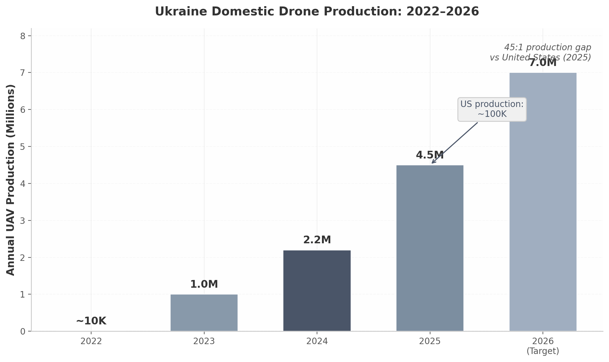
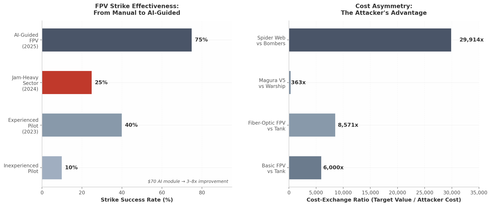

# Military Robotics & AI Drone Market — Battlefield Technology

**Date:** 2026-07-03  
**Purpose:** Extract the technologies winning in Ukraine and translate their lessons into Operator's product priorities.

---

## Ukraine: the world's live drone laboratory

The war in Ukraine has compressed more than a decade of autonomous-systems evolution into three years. The scale is industrial:

- **4.5 million UAVs produced annually** in Ukraine by 2025, targeting 7 million in 2026, with installed capacity exceeding 8 million FPV drones/year.
- **>160 registered drone manufacturers** in Ukraine, up from 7 in 2022.
- **~180,000 confirmed targets struck** by Ukrainian unmanned systems in a single month.
- **70–80% of battlefield casualties** attributed to drone operations.
- Drone teams represent ~2% of personnel but account for a major share of Russian losses.

The U.S. produces roughly 100,000 military drones per year — a **45:1 production gap**. This is not a temporary mobilization; it is a structural shift in how airpower is generated.

---

## Five phases of drone warfare evolution (2022–2026)

| Phase | Period | Dominant technology | Countermeasure | Significance |
|-------|--------|---------------------|----------------|--------------|
| 1. Commercial ISR | 2022 | DJI Mavic reconnaissance / grenade drops | RF jamming | Drones proved tactical ISR value. |
| 2. FPV revolution | 2023 | Kamikaze FPV drones | Broadband RF jamming | Production increased 100x. |
| 3. Industrial scale | 2024 | Naval USVs, fiber-optic FPVs, drone-on-drone | Russian Rubicon EW center | 2.2M drones; first naval warship sunk by drone. |
| 4. AI & autonomy | 2025 | AI terminal guidance, swarm coordination | Mesh modems, Starlink strike drones | AI strike accuracy rose to ~80%; 100+ swarm operations. |
| 5. Full autonomy & export | 2026 | Autonomous targeting, export frameworks | Directed energy (developmental) | 7M+ production target; 20,000+ UGVs planned. |

The cycle time between offensive innovation and defensive countermeasure has compressed to roughly **21 days for electronic-warfare solutions**. Any system requiring hardware changes to adapt is obsolete before it deploys.

---

## Technologies ranked by battlefield impact

| Rank | Technology | Unit cost | Key metric | Maturity |
|------|-----------|-----------|------------|----------|
| 1 | **AI-guided FPV drones** | ~$600 ($500 drone + $70 AI module) | Strike rate 10–20% → 70–80%; 65% of Russian tank losses | Mass production |
| 2 | **Fiber-optic FPV drones** | $300–$400 | Complete EW immunity; 35+ producers by early 2026 | Operational |
| 3 | **Naval USVs (MAGURA V5)** | $250K–$300K | $500M+ in damages; first USV air-to-air kill | Operational, 50/month |
| 4 | **UGVs (logistics/combat)** | $20K–$50K | 80% of logistics in some brigades; first prisoner capture by robots | Operational, 15,000 delivered 2025 |
| 5 | **Drone swarms (coordinated)** | Software + multiple drones | 100+ operations; 3–8 drone coordination; tested to 25 units | Demonstrated |
| 6 | **Interceptor drones** | Comparable to strike FPV | 4,000 Shaheds neutralized/month; doubled interception rate in 4 months | Operational |

### AI-guided FPV: the $70 multiplier

Ukrainian company Fourth Law developed an AI vision module costing ~$70 that raised FPV mission-success rates from ~20% to ~80%. The operator handles ingress; at ~500 meters the onboard AI takes terminal guidance, maintaining lock regardless of jamming.

Operator lesson: **local edge AI is not optional — it is the only survivable architecture in contested EW.** Cloud-dependent target recognition fails when links are jammed.

### Fiber-optic FPV: complete jam-proofing

Fiber-optic drones use a physical optical cable (0.2–0.5mm) for control and video. They are completely immune to RF jamming, transmit full HD with near-zero latency, and produce no radio signature. By early 2026, 35+ Ukrainian manufacturers produce them; Russian frontline adoption reached 30–50%.

The Pentagon reportedly set a 36-month deadline to field directed-energy counters, acknowledging no effective counter currently exists at scale.

Operator lesson: **physical-layer resilience beats RF sophistication.** Gossip/mesh protocols are the nearest software equivalent: when RF is denied, distributed state replication keeps the network alive.

### Naval drones (MAGURA V5)

The MAGURA V5 USV (5.5m, <1,000kg, 320kg payload, ~800km range) sank three major Russian warships in 2024 and shot down two Su-30s in 2025. Total Russian assets destroyed/damaged by Ukrainian naval drones exceeded $745M in 2025 alone.

Operator lesson: **attritable mass beats exquisite platforms.** The same logic applies to ground and air agents: many cheap, software-updatable sensors outperform a few expensive ones.

### Ground robots (UGVs)

UGV deliveries surged from 2,000 units in 2024 to 15,000 in 2025. In the 3rd Assault Brigade, UGVs conduct 80% of logistics operations; robotic platforms have reduced personnel casualties by up to 30%.

The watershed: July 2025, first recorded capture of prisoners using only unmanned vehicles.

Operator lesson: **multi-domain is real.** Air + ground + dock coordination is the next capability gap; ground agents need the same mission memory as air agents.

### Drone swarms

Ukrainian company Swarmer has flown 100,000+ combat missions and enables one operator to control up to seven drones autonomously, with a 100-drone target. Russia, by contrast, pursues mass saturation (273–400+ drone waves).

Operator lesson: **quality of coordination and quality of mass are both valid; Operator's gossip/mesh architecture supports both.**

---

## Cost asymmetry: the $500 drone vs. the $3M tank

| Attacker system | Unit cost | Typical target | Target value | Cost-exchange ratio |
|-----------------|-----------|----------------|--------------|---------------------|
| Basic FPV drone | $300–$500 | T-90M tank | ~$3M | ~6,000:1 to 10,000:1 |
| AI-guided FPV | ~$600 | T-90M in jam-heavy sector | ~$3M | ~5,000:1 |
| Fiber-optic FPV | $300–$400 | Armored vehicle / EW system | $500K–$3M | 1,250:1 to 10,000:1 |
| MAGURA V5 USV | $250K–$300K | Warship | $100M–$500M | ~333:1 to 2,000:1 |
| Spider Web FPV | ~$2,000 | Tu-95/Tu-160 bomber | ~$200M+ | ~100,000:1 per bomber |
| Full Spider Web op | ~$234,000 (117 drones) | 41 strategic aircraft | ~$7B total | ~29,914:1 |

These ratios are restructuring force planning worldwide. The survivability premium on individual platforms becomes a liability when adversaries distribute threat across thousands of cheap systems.

---

## Implications for Operator

1. **Don't compete with $500 FPVs.** Compete with the $2M Reaper replacement: persistent, jam-resistant situational awareness that coordinates air + ground agents and updates via software.
2. **Software-defined, rapidly updatable systems are the only survivable architecture.** The 21-day EW cycle means hardware-optimized systems are obsolete before deployment. OTA updates are a survivability requirement.
3. **Decentralized C2 is a survivability requirement.** Centralized systems become bricks when their command link is jammed. Gossip-based replication lets the swarm retain shared state even with 50% node loss.
4. **The customer is buying adaptation speed, not specifications.** Procurement is moving toward rapid iteration and combat relevance. Operator must demo working coordination, real 3D situational awareness, and real adaptability.
5. **Defensive ISR is the right entry point.** ISR contracts are 48% of the market, avoid LAWS friction, and build the operational trust needed for larger strike contracts later.

---

## Recommended product framings

- "When Palantir TITAN loses comms, it becomes a brick on a truck. When Operator loses 50% of its agents, the remaining 50% still have full mission memory."
- "We are not building a better drone. We are building the mission-memory layer that every drone, UGV, and dock shares."
- "TITAN is the division's AI vehicle. Operator is the fire team's AI tablet."
