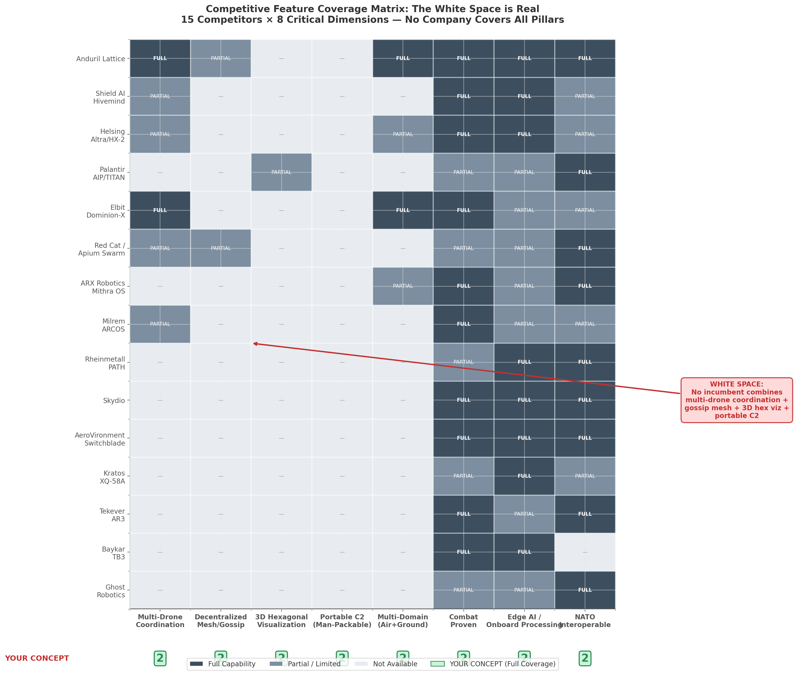

# Military Robotics & AI Drone Market — Competitive Landscape

**Date:** 2026-07-03  
**Purpose:** Map the competitive terrain and validate the white space for Operator's portable multi-agent C2 platform.

---

## The central finding

**No existing company combines all four of Operator's pillars:**

1. Multi-agent coordination (10–50 agents, air + ground)
2. Gossip-protocol / decentralized mesh networking
3. 3D hexagonal tactical visualization
4. Portable / backpackable C2

This was validated across **15 competitors and 8 capability dimensions**.

---

## Tier-1 incumbents

### Anduril Industries — $30.5B valuation
- **Product:** Lattice OS (autonomous OS), Fury CCA, Roadrunner C-UAS, ALTIUS, Bolt, Ghost Shark.
- **Scale:** Lattice coordinates 200+ autonomous surveillance towers; $20B Army counter-drone IDIQ; $8B+ backlog.
- **Gap:** Infrastructure-grade C2, not man-portable. Lattice Mesh is proprietary and requires towers/vehicles/command posts. No 3D hex visualization. No gossip-protocol resilience.
- **Operator positioning:** "Anduril built the division's AI nervous system. We are building the fire team's AI tablet."

### Palantir — TITAN ($178.4M contract)
- **Product:** TITAN (Tactical Intelligence Targeting Access Node), AIP.
- **Scale:** 10 prototypes (5 JLTV, 5 FMTV); Army's "first AI-defined vehicle."
- **Gap:** Basic variant requires a JLTV; advanced variant demands an FMTV truck. Fuses sensors but does not command drone swarms. No portable multi-agent C2.
- **Operator positioning:** "Palantir built the division's AI vehicle. We are the platoon's AI tablet."

### Shield AI — $12.7B valuation
- **Product:** Hivemind AI pilot (platform-agnostic autonomy software).
- **Scale:** Integrated on 6 aircraft types; $198M U.S. Coast Guard V-BAT contract.
- **Gap:** Autonomy software only — no C2 visualization layer, no multi-agent coordination interface, no portable command hardware.
- **Operator positioning:** "Hivemind flies the plane. Operator commands the swarm."

### Helsing — €12B valuation
- **Product:** HX-2 / HF-1 strike drones, Altra reconnaissance-strike platform, Cirra EW suite.
- **Scale:** 4,000 HF-1 + 6,000 HX-2 to Ukraine; €269M–€1.46B German framework potential.
- **Gap:** Ground-station-based Altra; SitaWare 2D COP integration; no 3D hex viz; no portable C2; no gossip mesh.
- **Operator positioning:** "Helsing built the European AI strike machine. We coordinate those strikes at the tactical edge."

### Elbit Systems — Dominion-X
- **Product:** Dominion-X (formerly Legion-X) heterogeneous air + ground swarm HMT.
- **Scale:** Combat-proven with IDF; Thor drones + Rook UGVs from one screen.
- **Gap:** Israeli/proprietary; container-based launch infrastructure; not portable; not NATO-interoperable; no 3D hex viz.
- **Operator positioning:** "Dominion-X requires containers. Operator requires a backpack."

---

## Emerging challengers

| Company | HQ | Funding / status | Primary product | White-space gap |
|---------|----|------------------|-----------------|-----------------|
| **Red Cat / Apium** | USA | Public (NASDAQ) | Black Widow + swarm stack | Air-only, ground-station dependent, no hex viz, not portable |
| **ARX Robotics** | Germany | €42M Series A (NIF-led) | Gereon UGV + Mithra OS | Ground-only, no swarm C2, no aerial coordination, not portable |
| **Tekever** | UK/Portugal | >$1B est. | AR3/AR4 drones | Drone manufacturer only; no C2 platform |
| **Milrem Robotics** | Estonia | Edge Group subsidiary | THeMIS UGV + ARCOS | Ground-only, early-stage ARCOS, no hex viz, no gossip |

The pattern: each challenger validates one dimension (distributed autonomy, European ground robotics, battlefield iteration speed, UGV orchestration) while leaving the integrated portable C2 layer unaddressed.

---

## Feature comparison matrix

| Competitor | Multi-agent coord. | Decentralized / gossip mesh | 3D hex viz | Portable C2 | Multi-domain (air+ground) | Combat proven | Edge AI | NATO interop |
|-----------|-------------------|----------------------------|------------|-------------|--------------------------|---------------|---------|--------------|
| Anduril Lattice | Yes — 200+ | Partial (proprietary Lattice Mesh) | No | No | Yes | Yes | Yes | Yes |
| Palantir TITAN | No | No | Partial (fusion) | No | No | Partial | Partial | Yes |
| Shield AI Hivemind | Partial (single aircraft) | No | No | No | No (air only) | Yes | Yes | Partial |
| Helsing Altra/HX-2 | Partial (swarms) | No (EW-resistant only) | No (2D COP) | No | Partial | Yes | Yes | Partial |
| Elbit Dominion-X | Yes (heterogeneous) | No (proprietary) | No | No | Yes | Yes | Partial | Partial |
| Red Cat / Apium | Partial (distributed) | Partial (proprietary) | No | No | No (air only) | Partial | Partial | Yes |
| ARX Robotics | No | No | No | No | Partial (via partners) | Yes | Partial | Yes |
| Milrem ARCOS | Partial (UGVs) | No | No | No | No (ground only) | Yes | Partial | Partial |
| Rheinmetall PATH | No | No | No | No | No (ground only) | Trials | Yes | Yes |
| Skydio | No | No | No | No | No | Yes | Yes | Yes |
| AeroVironment | No | No | No | No | No | Yes | Yes | Yes |
| Kratos XQ-58A | No | No | No | No | No | Partial | Yes | Partial |
| Tekever AR3 | No | No | No | No | No | Yes | Partial | Yes |
| Baykar TB3 | No | No | No | No | No | Yes | Yes | No |
| Ghost Robotics | No | No | No | No | No | Partial | Partial | Yes |
| **Operator** | **Yes — 10-50 agents** | **Yes — gossip protocol** | **Yes — 3D hex** | **Yes — tablet/backpack** | **Yes — air+ground+dock** | **TBD** | **Yes** | **Yes** |

---

## Five structural patterns

1. **Scale-portability tradeoff.** Every system with meaningful multi-agent coordination sacrifices portability. None has compressed multi-agent C2 into a backpack.
2. **Autonomy–C2 visualization divide.** Companies great at autonomous agents (Shield AI, Helsing) do not build coordination interfaces.
3. **Proprietary networking everywhere.** Anduril, Elbit, and Red Cat/Apium use proprietary meshes. None uses an open gossip protocol with epidemic broadcast.
4. **Hardware lock-in.** Every incumbent with coordination also manufactures its own hardware. A hardware-agnostic C2 layer remains unbuilt.
5. **3D hex visualization is uncontested.** Not a single existing BMS (SitaWare, ATAK, Palantir Gotham, TITAN) uses hexagonal tessellation. Legacy roadmaps prioritize interoperability over visualization innovation.

---

## White-space validation

| Pillar | Closest competitor | Their gap | Operator advantage | Market signal |
|--------|-------------------|-----------|-------------------|---------------|
| Multi-agent coordination (10–50) | Anduril Lattice (200+) | Infrastructure-grade; towers/CPs | Tablet-scale for platoon | Replicator, LASSO demand scalable C2 |
| Gossip-protocol mesh | Red Cat/Apium (distributed, proprietary) | Proprietary; air-only | Open gossip; EW-resilient | Academic: 42% DoS-resilience gain over centralized |
| 3D hex visualization | None — uncontested | Not implemented anywhere | First-to-market | Ukraine Delta proves BMS visualization need |
| Portable C2 | None at multi-agent scale | TITAN=FMTV; Lattice=towers; Dominion=containers | Rugged tablet, <5 lb | Every fire team needs ruck-ready C2 |

---

## Addressable market at the tactical edge

The tactical-edge C2 market is not yet a recognized budget line. Triangulation from adjacent segments yields **$2–5 billion by 2030, growing at 30%+ CAGR**.

Three demand signals:

1. **Replicator mass.** The DoD Replicator Initiative targets thousands of autonomous systems by 2027 without specifying the tactical-edge C2 layer. The platoon deploying 20 Ghost-X drones needs a command interface that does not yet exist.
2. **Ukraine EW lesson.** NATO eastern-flank members now procure EW-resilient C2 after Ukraine's Delta BMS validated mesh networking under continuous jamming.
3. **Procurement vacuum.** Next-Generation C2 (~$100M, Anduril) and TITAN ($178.4M, Palantir) target brigade-and-above. The PEO Soldier has no equivalent modernization program for dismounted infantry C2.

---

## Strategic positioning for Operator

| Versus | One-line positioning |
|--------|----------------------|
| Anduril | "Lattice manages the battlespace. Operator manages the fire team." |
| Palantir | "TITAN is the division's AI vehicle. Operator is the platoon's AI tablet." |
| Shield AI | "Hivemind flies the plane. Operator commands the swarm." |
| Helsing | "Helsing builds the strike drone. Operator coordinates the swarm at the edge." |
| Elbit | "Dominion-X requires containers. Operator requires a backpack." |

**Category creation, not feature improvement.** Operator is not a better 2D map. It is a new category: portable, decentralized mission-memory C2 for defensive ISR at the tactical edge.
