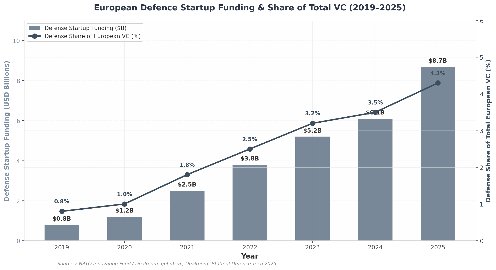

# Military Robotics & AI Drone Market — European Ecosystem

**Date:** 2026-07-03  
**Purpose:** Map EU/NATO funding programs, the Berlin defense scene, and procurement pathways for Operator.

---

## The European defense tech renaissance

European defense, security, and resilience (DSR) startups raised a record **$8.7 billion in 2025**, up 55% year-on-year. Defense accounted for ~4.3% of all European VC (vs. <1% in 2020); in Germany, defense/dual-use startups captured **17% of total domestic VC**.

Three European defense-tech unicorns now exist:

- **Helsing** (Germany) — €12B valuation
- **Quantum Systems** (Germany) — €3B+
- **TEKEVER** (Portugal) — >$1B

Germany sits at the epicenter:

- **$2.1B** in German defense tech funding since 2019 (#2 in Europe after UK).
- **Munich** is the dominant cluster (Helsing, Quantum Systems, ARX Robotics).
- **Berlin** is closing the gap via CIHBw, policy proximity, and software talent.
- German defense spending reached ~$114B in 2025 (+24% YoY); the post-debt-brake reform enables a projected €500B infrastructure/defense fund through 2029.

---

## Berlin defense tech scene

### Bundeswehr Cyber Innovation Hub (CIHBw)
- Germany's first military innovation unit and primary Bundeswehr–startup interface.
- Identifies operational problems from troops, prototypes with startups, tests under real military conditions.
- Co-hosted the European Defense Tech Hackathon in Berlin (Nov 2025).
- Value: operational validation, soldier feedback, procurement fast-track that compresses multi-year cycles into months.

### Startups and capital
- **30+ defense-relevant startups** in Berlin.
- **~€400M** invested in Berlin defense tech since 2024.
- Notable names: 3YOURMIND (on-demand defense manufacturing, first EUDIS cohort), SE3Labs (AI battlefield intelligence).
- Real-estate demand now includes Faraday cages, secure infrastructure, and hardware labs — signaling the ecosystem is maturing from software-only to hardware-capable.

### Key events
- **European Defense Tech Hackathon — Berlin** (co-hosted with CIHBw, around Berlin Security Conference)
- **Freedom & Defense Tech Forum** (French-German-EU dual-use / AI intelligence)
- **EUDIS Defence Hackathon** (8 EU locations simultaneously)
- **European Defense Tech Hackathon — Munich** (during Munich Security Conference; draws primes, late-stage investors, international delegations)

---

## EU and NATO funding programs master guide

| Program | Type | Budget / scale | Eligibility | Funding amount | Next deadline |
|---------|------|----------------|-------------|----------------|---------------|
| **EDF 2026 — Thematic Calls** | R&D grants | €1B total | 3+ entities from 3+ EU/NO states | 70–100% of costs; €15M–150M+ per topic | 29 Sep 2026 |
| **EDF 2026 — SME Non-Thematic** | R&D lump-sum grants | €65M+ | SME-led consortia, 3+ states | Up to €6M per project | 29 Sep 2026 |
| **EDF 2026 — Disruptive Tech** | R&D grants | €56M | 2+ entities from 2+ states | Lump sum | 29 Sep 2026 |
| **EUDIS Business Accelerator** | Accelerator + voucher | €231M (total EUDIS 2026) | EU/NO startups & scale-ups | €120K + €50K top-3 | Autumn Cohort 3: 30 May 2026 |
| **EUDIS Defence Hackathon** | Hackathon + mentoring | Part of EUDIS | EU innovators | Prizes + mentoring | Autumn 2026 (TBA) |
| **EUDIS Tech Challenge** | R&D competition | Part of EUDIS | SME consortia | R&D funding | Via EDF calls |
| **EDF Cascade Funding (FSTP)** | Sub-grants via projects | Varies | SMEs, startups, Ukraine | Up to €60K | Varies by project |
| **NATO DIANA Accelerator** | Accelerator + grant | NATO-funded | All 32 NATO members | €100K + €300K Phase 2 | 2027 Cohort: Jun–Jul 2026 |
| **NATO Innovation Fund (NIF)** | Venture capital | €1B+ | Startups in 24 LP nations | Up to €15M initial | Rolling (warm intros) |
| **EIC STEP Defence Scale Up** | Direct equity | €100M | EU/EEA/UA scale-ups | Up to €30M equity | 28 Oct 2026 |
| **EIC Accelerator** | Grant + equity | €100M (STEP Defence) | EU/EEA/UA SMEs | Up to €2.5M grant + €30M equity | 28 Oct 2026 |
| **Defence Equity Facility** | Fund of funds | €175M | VC funds investing in defence | €30–50M per fund | Rolling |
| **EIB Defence Loans** | Debt financing | €4B+ annually | EU defence companies | Project-sized loans | Rolling |

### Recommended capital stack by stage

| Stage | TRL range | Priority programs | Combined non-dilutive | Timeline |
|-------|-----------|-------------------|----------------------|----------|
| Early | TRL 2–4 | EUDIS Hackathon → NATO DIANA Phase 1 | ~€100K | Months 1–6 |
| Growth | TRL 4–6 | EUDIS Accelerator (€170K) → DIANA Phase 2 (€300K) → EDF SME (€6M) | €6.5M+ | Months 6–18 |
| Scale-up | TRL 6–9 | EDF Development Action → EIC STEP Defence (€30M) → EIB venture debt | €30M+ | Months 18–36 |

---

## Key program details

### European Defence Fund (EDF)
- **2026 budget:** €1B across 10 calls and 31 topics.
- **Development Actions:** €676M (TRL 5–8), 70–90% funding rates.
- **Research Actions:** €329M (TRL 2–4), up to 100% funding.
- **SME Non-Thematic Development Action:** up to €6M per proposal, TRL 4+, bottom-up.
- **Requires:** consortium of ≥3 entities from ≥3 EU/NO states (disruptive tech calls allow 2+2).
- **Deadline:** 29 September 2026.
- **Action:** register on EU Funding & Tenders Portal and obtain a PIC code immediately.

### EUDIS Accelerator
- **40 companies/year**, two cohorts.
- **€120K seed voucher** + **€50K top-three prize**; no equity, no IPR claims.
- **Autumn 2026 Cohort 3:** application opens May–June 2026, deadline 30 May 2026, webinar 29 April 2026.
- **Technological Challenge 2026** focuses on "AI-based tactical situational awareness using swarms of small robots and drones" — a direct fit for Operator.

### NATO DIANA
- **2026 cohort:** 3,680 applications, 150 selected from 24 NATO countries (4.1% acceptance).
- **Phase 1:** €100K non-dilutive + 6-month accelerator.
- **Phase 2:** up to €300K for top performers.
- **20+ accelerator sites, 180+ test centres** across 32 NATO nations.
- **2027 Cohort:** expected to open June–July 2026.
- Challenge areas include "Autonomy and Unmanned Systems" and "Data Assisted Decision Making."

### NATO Innovation Fund (NIF)
- **€1B+ standalone VC fund** backed by 24 NATO allies.
- **22 direct investments** including ARX Robotics (€31M Series A), TEKEVER, Fractile, Isar Aerospace, Quantum Systems.
- **Tickets up to €15M** at Seed–Series B.
- **No cold applications** — introductions through DIANA alumni, national hubs, or portfolio referrals.

### Horizon Europe EIC — STEP Defence
- **Historic opening:** 17 June 2026 — Horizon Europe/EIC accepted defense/dual-use for the first time.
- **EIC STEP Defence Scale Up:** €100M allocated; up to €30M direct equity per company.
- Targets air/missile defense, drones/counter-drones, critical defense tech.
- **Deadline:** 28 October 2026.

### European Investment Bank
- **€4B+ annually** in security/defense financing (2025), targeting 5% of all EU financing.
- Excludes weapons/ammunition; funds AI, sensors, UAVs, communications, cybersecurity, space systems.
- TechEU programme: €70B EIB Group equity/quasi-equity/loans/guarantees 2025–2027.

---

## PESCO and collaborative projects

PESCO creates pooled procurement demand and identifies EU government priorities.

| Project | Coordinator | Members | Focus | Relevance to Operator |
|---------|-------------|---------|-------|----------------------|
| **Integrated UGS (IUGS)** | Estonia | 11 countries incl. Germany | Modular UGVs logistics/recon/combat | Subsystem supplier for autonomy/communications |
| **IUGS2** | Estonia | Adds Italy, Sweden | Next-gen UGS | Expanded addressable market |
| **Eurodrone (MALE RPAS)** | Germany (OCCAR) | DE, FR, IT, ES | €7.1B MALE drone programme | Subsystems: mission planning, detect-and-avoid, edge payloads |
| **Counter-UAS** | Italy | Multiple nations | Drone detection/neutralization | Fastest-growing segment (21.1% CAGR) |
| **MAS MCM** | Belgium | 7 countries | Naval mine-countermeasure drones | Multi-domain autonomy path |
| **CSIP** | Italy | 6 countries | Underwater infrastructure monitoring | Future expansion |

Germany's participation in UGS, Eurodrone, and Counter-UAS gives a Berlin-based startup a domestic advocate within PESCO.

---

## Procurement pathways

| Channel | Speed | Best for | How to access |
|---------|-------|----------|---------------|
| **CIHBw (Germany)** | 3–6 months | Operational validation, fast Bundeswehr pilot | Apply via CIHBw rolling calls |
| **AID Guichet Unique (France)** | 3–6 months | Grants + pilots | 75 proposals processed Q1 2025; €20M secured |
| **DASA (UK)** | 3–6 months | SME R&D contracts | £285M invested since 2016, 60% to SMEs |
| **EDF / EUDIS** | 6–18 months | Large R&D grants, consortium building | EU Funding & Tenders Portal |
| **NATO DIANA** | 6–18 months | Non-dilutive funding + test centres | diana.nato.int |
| **PESCO subcontracts** | 12–24 months | Multi-national reference customers | National MoD contact point |
| **Ukraine BRAVE1 / 17Tech** | Weeks–months | Combat validation | Rolling applications |

---

## Action items for Operator

1. **Register on the EU Funding & Tenders Portal and obtain a PIC code** (Day 1).
2. **Apply to EUDIS Business Accelerator Autumn Cohort 3** by 30 May 2026.
3. **Prepare NATO DIANA 2027 Cohort concept note** for the June–July 2026 window.
4. **Identify 2+ consortium partners** across EU member states for the EDF SME call (deadline 29 Sep 2026).
5. **Engage CIHBw** for operational validation and soldier feedback.
6. **Build relationships with NIF-connected Berlin funds** (JOIN Capital, Project A Ventures) via warm intros.
