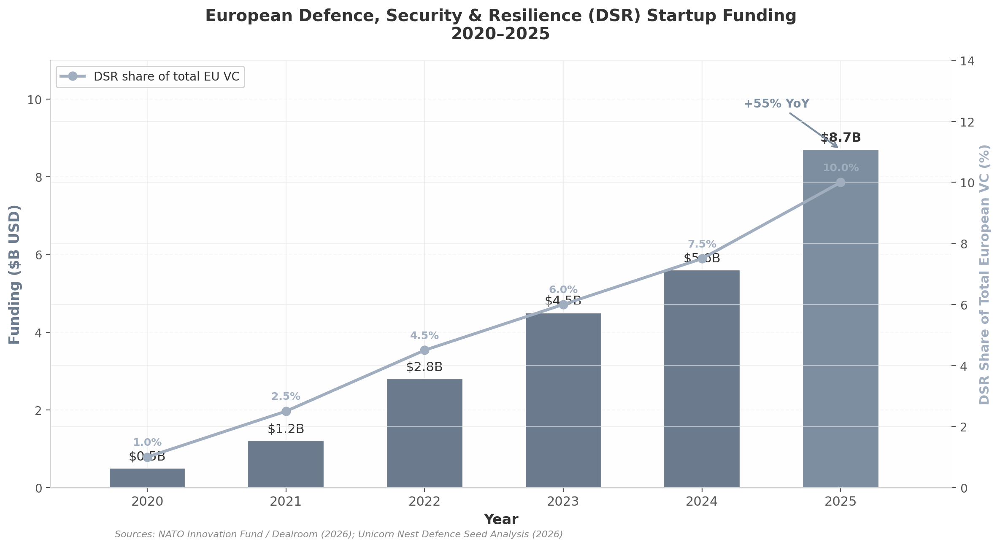

# Military Robotics & AI Drone Market — Go-to-Market & Funding Strategy

**Date:** 2026-07-03  
**Purpose:** Define the capital stack, team composition, and 90-day action plan to move Operator from concept to first revenue.

---

## The capital environment

European DSR startups claimed ~10% of all European VC in 2025, up from ~1% in 2020. Half of all new German unicorns were defense or dual-use. The EIB quadrupled security/defense financing to €4B annually, and Horizon Europe/EIC opened to defense for the first time in 2026.

This is not a bubble. It is a geopolitical reallocation driven by Russia's war, US pressure for NATO burden-sharing, and European sovereignty imperatives.

---

## Optimal capital stack

The most capital-efficient European defense startups **stack non-dilutive grants first**, then raise equity from a position of validation.

### Phase 1: Non-dilutive — €500K–6.5M

| Step | Program | Funding | Dilution | Next deadline | TRL target |
|------|---------|---------|----------|---------------|------------|
| 1A | **EUDIS Business Accelerator** | €120K (+ €50K top-3) | Zero | 30 May 2026 (Autumn Cohort 3) | 3–4 |
| 1B | **NATO DIANA Phase 1–2** | €100K–300K | Zero | Jun–Jul 2026 (2027 cohort) | 3–5 |
| 1C | **EDF SME Non-Thematic Call** | Up to €6M | Zero | 29 Sep 2026 | 4+ |

**Combined non-dilutive potential before first equity:** €500K–6.5M.

### Phase 2: Seed — €2–5M at €8–15M pre-money

- European defense seed rounds in 2026: **€2–5M** at pre-money valuations of **€8–15M**.
- Investors expect entry at TRL 4–5 and target TRL 6 by end of seed.
- Use of funds: 60% product, 25% government BD, 15% operations.

### Phase 3: Series A — €10–20M

- Target investors: NATO Innovation Fund, General Catalyst, Founders Fund / Prima Materia, Vsquared, Balderton, JOIN Capital, OTB Ventures, Project A, Expansion VC, Gungnir Capital.
- EIC STEP Defence Scale Up: up to €30M direct equity (deadline 28 Oct 2026).

### Investor directory

| Investor | HQ | Stage | Typical ticket | Defence track record |
|----------|----|-------|----------------|----------------------|
| NATO Innovation Fund | Amsterdam | Seed–Series B | Up to €15M | ARX Robotics €31M, TEKEVER, Fractile |
| General Catalyst | US/Europe | Series A–C | €20–200M+ | Led Helsing B & C |
| Founders Fund / Prima Materia | US/Sweden | Seed+ | $1–10M | Anduril seed, Helsing seed |
| Vsquared Ventures | Munich | Seed–Series A | €2–10M | Helsing, NIF portfolio |
| Balderton Capital | London | Series A–B | €10–50M | Quantum Systems €160M |
| JOIN Capital | Berlin | Pre-seed–Series A | €1–5M | NIF portfolio |
| OTB Ventures | Warsaw/London | Seed–Series A | €3–10M | NIF portfolio |
| Project A Ventures | Berlin | Pre-seed–Series A | €1–5M | Led ARX pre-seed €1.15M |
| EQT Ventures | Stockholm | Seed–Series B | €3–15M | Backed Helsing |
| Expansion VC | Paris | Pre-seed–Series B | €0.5–5M | Aerospace & defence specialist |
| Gungnir Capital | Stockholm | Pre-seed–Series A | €0.5–3M | Drones, edge AI |

---

## Team composition — the magic formula

Every defense unicorn follows the same pattern:

1. **Technical founder** who ships under constraint.
2. **Defense domain expert** — ex-military or senior contractor — who understands procurement and speaks customer.
3. **Government BD person full-time**, not a side role, with program-office relationships.

### Proof points

| Company | Founded | Defence insider | Time to first contract | Valuation | Key enabler |
|---------|---------|-----------------|------------------------|-----------|-------------|
| Helsing | Mar 2021 | German MoD | ~1.5 years | €12B (2025) | MoD access → prime partnerships |
| Quantum Systems | 2015 | Bundeswehr pilot | ~2 years | €3B+ (2025) | Military founder → Ukraine pivot |
| Anduril | Apr 2017 | Palantir/DoD | ~2 years | $14B+ (2025) | CBP first, then DoD |
| ARX Robotics | ~2021 | Bundeswehr | ~1.5 years | Series A | Institutional credibility → NIF |

### Immediate hiring priorities

- **Ex-military advisor (0.25–1% equity):** retired NATO/Bundeswehr officer with drone/operations background; deliverables include introductions to 3+ programme officers within 90 days.
- **Government BD hire (~€120K/year):** BAAINBw, DGA, DE&S, or DASA experience; knows which capability gaps are funded and which officers can sign rapid contracts below €100K.

**Rule:** a technical founder without a defense insider is a hobby project. The same founder with a retired Bundeswehr major and a DGA programme manager becomes fundable at €10M pre-money.

---

## Go-to-market pathway

### Defense-first, not dual-use

Conventional wisdom says pursue commercial revenue first because defense procurement is slow. For 2026, this is wrong:

- EU military drone regulation is Member State competence — no EASA certification.
- EU AI Act exempts military-only systems.
- Procurement is accelerating: France's DGA ordered 1,000 drones directly from Harmattan AI in 2025; Estonia's defense industry grew 350% since 2021.
- Defense contracts provide reference credibility that commercial customers value; the reverse is rarely true.

**Recommendation:** go defense-first with a commercial track 3–6 months behind.

### Hackathon → pilot → framework agreement (12-month timeline)

| Phase | Timeline | Goal | Key actions |
|-------|----------|------|-------------|
| **Hackathon** | Month 0–1 | Win/place at EUDIS or Berlin event | Working 3D hex + gossip demo; pitch video |
| **Accelerator + pilot** | Month 1–6 | Non-dilutive funding + paid validation | EUDIS / DIANA; CIHBw / DASA / AID pilot (€50K–200K) |
| **Framework agreement** | Month 6–12 | Transition to "programme of record" | Convert pilot into pre-negotiated purchasing mechanism |

### Key procurement channels

| Channel | Speed | Best for |
|---------|-------|----------|
| CIHBw (Germany) | 3–6 months | Operational validation, Bundeswehr pilot |
| AID Guichet Unique (France) | 3–6 months | Grants + pilots |
| DASA (UK) | 3–6 months | SME R&D contracts |
| EDF / EUDIS | 6–18 months | Large R&D grants, consortium building |
| NATO DIANA | 6–18 months | Non-dilutive funding + test centres |
| PESCO subcontracts | 12–24 months | Multi-national reference customers |
| Ukraine BRAVE1 / 17Tech | Weeks–months | Combat validation |

**Benchmark:** ARX Robotics moved university research → pre-seed → NIF-led seed → €31M Series A in under three years. The 12-month timeline is realistic with parallel execution.

---

## 90-day action plan

| Day | Action | Deliverable | Cost |
|-----|--------|-------------|------|
| 1 | Register EU Funding Portal; obtain PIC | PIC code | Free |
| 2 | Incorporate GmbH/UG or OÜ | Certificate | €500–2K |
| 3 | Open bank account; set up accounting | IBAN | €50/mo |
| 4–7 | Stabilize hackathon demo; document architecture | Stable codebase | Time only |
| 8–14 | Recruit advisory board: 1 ex-military NATO, 1 gov BD | 2 advisory agreements | Equity 0.25–1% each |
| 15–21 | Submit EUDIS Accelerator Autumn Cohort app | Submitted app + pitch video | Free |
| 22–28 | Draft DIANA 2027 concept note + team bios | Concept note | Free |
| 29–30 | Register EUDIS matchmaking; book EDF brokerage | Matchmaking profile | Free |
| 31–45 | Build field-testable prototype; outdoor testing | Field test report + video | €2–5K |
| 46–50 | Identify 2+ consortium partners for EDF SME call | LOIs / partnership agreements | Time only |
| 51–60 | Submit EDF SME pre-proposal; attend brokerage | Pre-proposal + MoU | Free |
| 61–75 | Build investor target list; pitch deck; data room | Deck + data room | Time only |
| 76–82 | Warm intros to 5 Tier-1/2 investors via advisors/NDCN | 5+ conversations scheduled | Time only |
| 83–90 | Pilot demos with CIHBw, DASA, or AID | 2+ pilot proposals | Travel |

**Total cash required:** €5K–10K.

---

## Pitch-deck priorities for defense investors

Replace SaaS metrics with defense-specific signals:

- TRL assessment and path to TRL 6.
- Procurement pipeline value and named program offices.
- Reference customer letters / LOIs.
- STANAG / NATO interoperability roadmap.
- Grant stack already secured.
- Team defense credentials.
- Unit economics per agent / per platoon deployment.

---

## Bottom line

The capital is available. The customers are buying. The constraint is execution across four workstreams simultaneously: grants, product, team, and government BD. The 90-day plan is the map; the founder's job is to walk it without dropping any stream.
