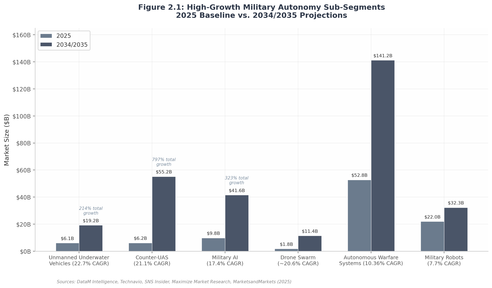
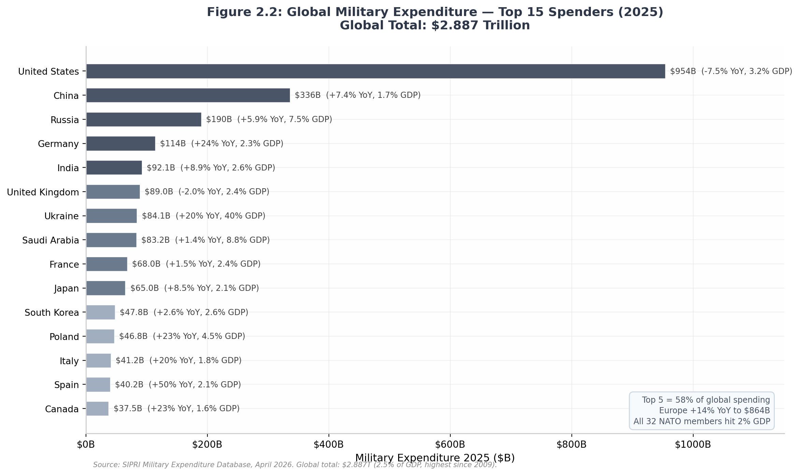

# Military Robotics & AI Drone Market — Market Sizing

**Date:** 2026-07-03  
**Purpose:** Quantify the addressable market for Operator's portable multi-agent C2 and defensive ISR stack.

---

## Global military robotics market

The global military robots market is estimated at **$19–25 billion in 2025** and projected to reach **$32–44 billion by the early 2030s**, with convergent CAGR of **6.3–8.7%** across independent forecasters.

| Research firm | 2025 market | Forecast | CAGR | Scope |
|---------------|-------------|----------|------|-------|
| Maximize Market Research | $19.23B | $32.32B (2032) | 7.7% | UGV/UAV/USV platforms |
| Precedence Research | $25.43B | $44.23B (2034) | 6.34% | Broader autonomous systems incl. software |
| Grand View Research | $19.68B (2024) | $32.50B (2030) | 8.7% | Military robots + AI-enabled systems |
| **Consensus** | **$19–25B** | **$32–44B** | **6.3–8.7%** | — |

The $6B spread between estimates is itself a signal: as autonomy software becomes inseparable from platform value, the definitional boundary expands in favor of a larger TAM. For a software-defined C2 platform, the broader definition is the relevant one.

---

## High-growth sub-segments

Operator sits at the intersection of the three fastest-growing software-enabled segments.

| Sub-segment | 2025 value | 2034/2035 projection | CAGR | Why it matters for Operator |
|-------------|------------|----------------------|------|----------------------------|
| **Counter-UAS (C-UAS)** | $6.16B | $55.25B (2034) | 21.1% | Defensive ISR and drone-aware C2 are core enablers. |
| **Unmanned underwater vehicles** | $6.12B | $19.22B (2031) | 22.7% | Validates multi-domain autonomy demand; future expansion path. |
| **Military AI (software/stack)** | $9.82B | $41.58B (2035) | 17.4% | Operator's edge-AI and decision-support layer maps here. |
| **Drone swarm systems** | $1.8B | $11.4B (2034) | ~20.6% | Direct addressable market for multi-agent coordination. |
| **Loitering munitions** | $2.81–4.68B | $5.06–29.48B | 8.8–20.3% | Strike optionality after ISR traction. |
| **Autonomous warfare systems (total stack)** | **$52.78B** | **$141.18B (2035)** | **10.36%** | Broadest TAM for a multi-product software platform. |
| **Unmanned ground vehicles** | $3.94B | $9.49B (2035) | 9.19% | Ground-agent coordination is a key Operator use case. |

---

## TAM / SAM / SOM for Operator

| Level | Definition | Estimate | Rationale |
|-------|------------|----------|-----------|
| **TAM** | Autonomous warfare systems market | **$52.78B (2025) → $141.18B (2035)** | Broad stack: platforms, autonomy software, C2, sensor networks, logistics. |
| **SAM** | Tactical-edge C2 + defensive ISR software for NATO/EU platoon–company units | **$2–5B by 2030, 30%+ CAGR** | Triangulated from C-UAS, swarm, and military-AI sub-segments; no recognized segment yet exists. |
| **SOM (Year 5)** | Capture 0.5–1.0% of SAM in EU + select NATO markets | **$10–50M ARR** | Realistic for a focused startup with 2–3 reference customers and prime partnerships. |

**Unicorn threshold:** 0.5% of the $19–25B base TAM ≈ $100M revenue — the current defense-tech valuation threshold.

---

## Defense spending macro trends

- **Global military expenditure reached $2.887 trillion in 2025** (SIPRI), the highest ever recorded.
- **All 32 NATO members met the 2% GDP target for the first time in history** (2025).
- NATO raised the target to **5% of GDP by 2035**, with 3.5% core military spending.
- The **US DoD FY2026 budget** includes a first-ever standalone **$13.4 billion autonomy line item**.
- **Germany** increased defense spending **24%** to ~$114B in 2025; post-debt-brake reforms enable a projected €500B infrastructure/defense fund through 2029.
- **Poland** spent **4.5% of GDP** and shifted autonomous/unmanned procurement share from 2% to 16%.
- The **Baltics** pledged 5% of GDP by 2026, a decade ahead of NATO's deadline.

---

## Investment flows

Defense technology VC reached a record **$49.1 billion in 2025**, nearly doubling from $27.2B in 2024. Equity funding more than doubled to $17.9B.

| Segment / metric | 2024 | 2025 | Change |
|------------------|------|------|--------|
| Global defense tech VC | $27.2B | $49.1B | +80% |
| Defense tech equity funding | $7.3B | $17.9B | +145% |
| European defense tech equity funding | ~$1.8B | $2.48B | +38% |
| European DSR startup funding | ~$5.6B | $8.7B | +55% |
| Number of active investors | Baseline | +41% | Mainstream VCs entering |

### Landmark valuations (2025)

| Company | Valuation | Est. revenue | Revenue multiple | Focus |
|---------|-----------|--------------|------------------|-------|
| Anduril | $30.5B (primary) / $61B (secondary est.) | ~$2.2B | 13.9–27.7x | Lattice OS, autonomous systems, C-UAS |
| Helsing | €12B (~$13B) | Undisclosed | N/A | European battlefield AI |
| Shield AI | $5.3B | ~$400M | ~13.3x | Hivemind AI pilot |
| Saronic | $4B | $200–400M | 10–20x | Uncrewed surface vessels |
| Palantir | ~$348B mkt cap | $5.22B TTM | ~66.7x | Defense/government AI software |
| **Legacy primes (LMT/NOC/BA)** | — | — | **1.6–2.7x** | Manned platforms, missiles, space |

The **14x valuation gap** between new-defense software platforms and legacy primes reflects investor conviction that software-defined autonomous systems represent a structural repricing, not a cyclical spending uptick.

---

## Strategic takeaways

1. **The money is in the software layer.** C-UAS, military AI, and swarm coordination are software-defined segments with 17–21% CAGR — far above the baseline hardware market.
2. **European capital is abundant and non-dilutive.** $8.7B in European DSR startup funding and a deep grant architecture (EUDIS, DIANA, EDF) de-risk early stages.
3. **Tactical-edge C2 is not a recognized segment yet.** That is the opportunity. Operator can define and own the category before incumbents move down from brigade-level systems.
4. **Defense investors price platform potential, not just current revenue.** Anduril's 27.7x multiple shows that a credible autonomy platform commands tech multiples.

---

## Recommended numbers to cite

- TAM: **$52.78B autonomous warfare systems market (2025)**.
- Target segment: **$2–5B tactical-edge C2 / defensive ISR software by 2030, 30%+ CAGR**.
- Funding context: **$49.1B defense tech VC in 2025**; **$8.7B European DSR startup funding**.
- Customer budgets: **$13.4B US DoD FY2026 autonomy budget**; **all 32 NATO members at 2% GDP**; **Germany +24% defense spending**.
- Exit/comparable multiples: **Anduril 27.7x revenue vs. Lockheed Martin 1.7x**.
