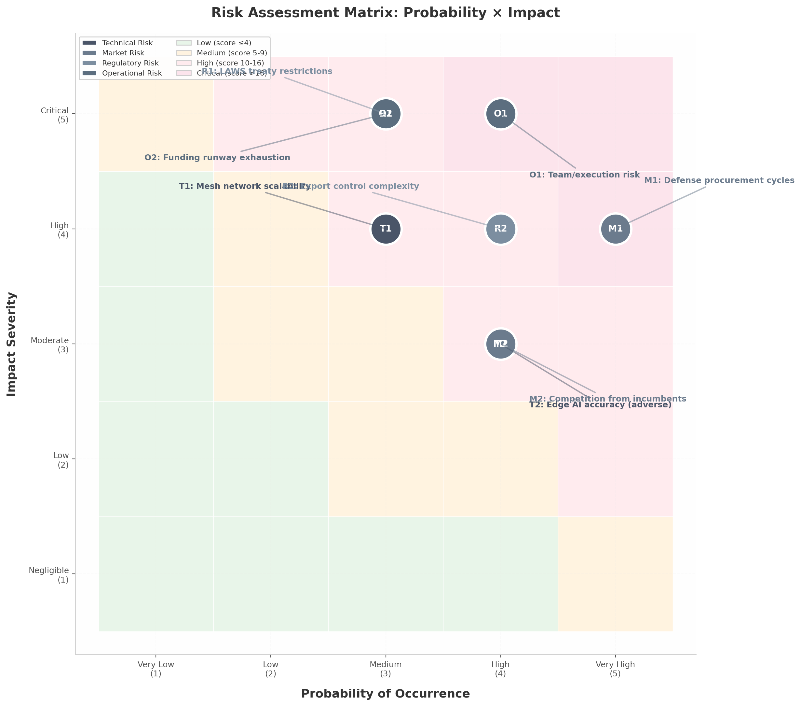

# Military Robotics & AI Drone Market — Risk Assessment

**Date:** 2026-07-03  
**Purpose:** Identify the highest-probability, highest-impact risks to Operator and prescribe concrete mitigations.

---

## Risk matrix

| ID | Risk | Category | Probability (1–5) | Impact (1–5) | Score | Priority |
|----|------|----------|-------------------|--------------|-------|----------|
| T1 | Mesh network scalability degrades beyond 50 nodes | Technical | 3 | 4 | 12 | High |
| T2 | Edge AI accuracy drops in adverse weather/terrain | Technical | 4 | 3 | 12 | High |
| M1 | Defense procurement cycles exceed cash runway | Market | 5 | 4 | 20 | Critical |
| M2 | Well-funded incumbent replicates niche feature set | Market | 4 | 3 | 12 | High |
| R1 | LAWS treaty restricts autonomous strike capability | Regulatory | 3 | 5 | 15 | Critical |
| R2 | Export-control licensing delays EU market entry | Regulatory | 4 | 4 | 16 | Critical |
| O1 | Team lacks defense domain expertise to close first contract | Operational | 4 | 5 | 20 | Critical |
| O2 | Non-dilutive funding fails, forcing premature equity raise | Operational | 3 | 5 | 15 | Critical |

*Score = Probability × Impact. Scores ≥12 require active mitigation; scores ≥15 require contingency plans.*

**Key insight:** operational and regulatory risks — not technical risks — are the gravest threats. The underlying technologies are validated; the venture dies from market timing, regulatory missteps, or team inadequacy long before a gossip packet fails.

---

## Technical risks

### T1: Mesh scalability beyond 50 nodes

**Evidence:** B.A.T.M.A.N. V packet-delivery ratio drops from 100% at 2 nodes to 42.8% at 11 nodes in outdoor Raspberry Pi tests. DDS over lossy RF suffers UDP fragmentation. No existing system has deployed gossip + DDS + cognitive SDR at 50–100 nodes in contested EW.

**Mitigation:**
- Implement hierarchical clustering before reaching 50 nodes.
- Partition swarm into sub-networks of 15–20 nodes with cluster heads participating in inter-cluster gossip.
- Validate scaling incrementally: 10 nodes by month 6, 25 by month 12, 50+ by month 18.
- Halt scaling if packet-delivery ratio drops below 80% at any tier.

### T2: Edge AI accuracy in adverse conditions

**Evidence:** Project Maven accuracy dropped below 30% in desert terrain with changing weather. Snow, dense foliage, and decoys consistently hinder computer vision.

**Mitigation:**
- Architect for multi-sensor fusion (EO/IR, acoustic, inertial) from day one.
- Implement confidence scoring; request human verification below threshold.
- Train on adversarial datasets: weather degradation, camouflage, EW countermeasures.
- Target 85% accuracy clear / 65% degraded / manual fallback below.

---

## Market risks

### M1: Procurement cycles exceed cash runway

**Evidence:** Traditional defense procurement spans 18–36 months. Helsing's first major contract took ~3 years; Anduril's took ~18 months. A pre-seed startup with 18–24 months runway cannot survive a 24-month cycle.

**Mitigation:**
- Front-load non-dilutive funding: EUDIS (€170K) → DIANA (€100–300K) → EDF SME (up to €6M) → seed.
- Target Ukrainian battlefield pilots as reference customers; Ukraine allocates $60M/month to combat units with decisions in weeks.
- Pursue national fast-track programs (CIHBw, AID, DASA) for €50K–200K pilots.

### M2: Incumbent replicates the niche

**Evidence:** Anduril ($61B valuation), Helsing (€12B), and Red Cat/Apium have resources to allocate engineering teams to promising niches.

**Mitigation:**
- Defend through speed of iteration and niche depth, not feature parity.
- Maintain open-core strategy: publish gossip protocol specification as an open standard; keep 3D hex visualization and sensor fusion proprietary.
- Position as "TITAN is the division's AI vehicle; Operator is the fire team's AI tablet" — a gap too small for primes to prioritize.

---

## Regulatory risks

### R1: LAWS treaty restricts autonomous strike

**Evidence:** UN CCW GGE rolling text is advancing; 70+ states support negotiation; November 2026 Review Conference is the decision point. A binding prohibition on systems that identify/select/engage targets without human intervention would constrain strike expansion.

**Mitigation:**
- Pursue ISR-first architecture with a software-defined human-authorization gate.
- Keep strike capability modular and contingent on regulation/customer.
- Align with DoD Directive 3000.09 pillars from the outset.

### R2: Export-control licensing delays

**Evidence:** Germany's KrWaffKontrG carries up to 5 years imprisonment for violations. BAFA processing can take weeks to months and may defer politically sensitive applications. EU Dual-Use Regulation 2021/821 covers electronics, telecom, sensors, navigation. ITAR can control entire products if US-origin content exceeds de minimis thresholds.

**Mitigation:**
- Engage German export-control attorney before production code.
- Register for CERTIDER and pursue defense-undertaking status under Intra-EU Transfer Directive.
- Minimize US-origin ITAR components; prefer EU-sourced alternatives.
- Focus on EU market for first 24 months.

---

## Operational risks

### O1: Team lacks defense domain expertise

**Evidence:** Every defense unicorn (Anduril, Helsing, Shield AI, Quantum Systems, ARX) had a defense insider. Helsing's €12B valuation in 4 years was heavily enabled by co-founder Gundbert Scherf's German MoD relationships.

**Mitigation:**
- Recruit a retired NATO/Bundeswehr officer as advisor or co-founder before approaching investors.
- Hire a full-time government BD person with BAAINBw/DGA/DE&S/DASA experience.
- Advisor agreements must include deliverables (e.g., 3+ programme-officer introductions in 90 days).

### O2: Non-dilutive funding fails

**Evidence:** EUDIS, DIANA, and EDF are competitive. Failure to secure grants forces premature equity raise on unfavorable terms.

**Mitigation:**
- Apply to EUDIS, DIANA, and national programs in parallel, not sequence.
- Build demo video and field-test evidence that strengthens every application.
- Maintain 24–30 month runway target; do not optimize valuation over runway.

---

## Scenario planning

| Scenario | Trigger | Outcome | Response |
|----------|---------|---------|----------|
| **Bull** | EUDIS + DIANA + EDF SME all secure; Ukrainian pilot within 6 months | TRL 6 by month 18; seed at €15M+ pre-money | Accelerate hiring; expand to 50-agent field tests |
| **Base** | One grant secures; one pilot LOI by month 9 | TRL 5 by month 18; seed at €8–12M pre-money | Continue grant stacking; deepen CIHBw relationship |
| **Bear** | No grants by month 6; no defense advisor; export counsel not engaged | Runway <12 months; unfavorable seed or shutdown | Pivot to commercial dual-use (agriculture, search & rescue) while preserving defense architecture |

---

## Kill criteria

| Condition | Trigger metric | Decision timeline |
|-----------|---------------|-------------------|
| No defense insider recruited | Month 3 with no advisor or BD hire | Reassess founder-market fit |
| No grant or pilot LOI | Month 6 with zero non-dilutive or LOI | Pivot to commercial dual-use or shutdown |
| Export-control blocker | BAFA denies classification or license | Restructure as EU-only, software-only C2 layer |
| LAWS prohibition on ISR-adjacent systems | Binding treaty includes reconnaissance autonomy | Pivot to pure C2/data-layer with no onboard target selection |
| Incumbent launches direct competitor | Anduril/Helsing announces portable hex-C2 | Double down on open-core ecosystem and speed of iteration |

---

## Bottom line

Technical risks are solvable with proven engineering. Market and regulatory risks demand strategic positioning — ISR-first, EU-first, open-core. Operational risks demand immediate action on team and funding pipeline. Allocate 60% of management effort to the critical-zone items (procurement timing, team building, export compliance, runway extension). Survival favors the paranoid.
