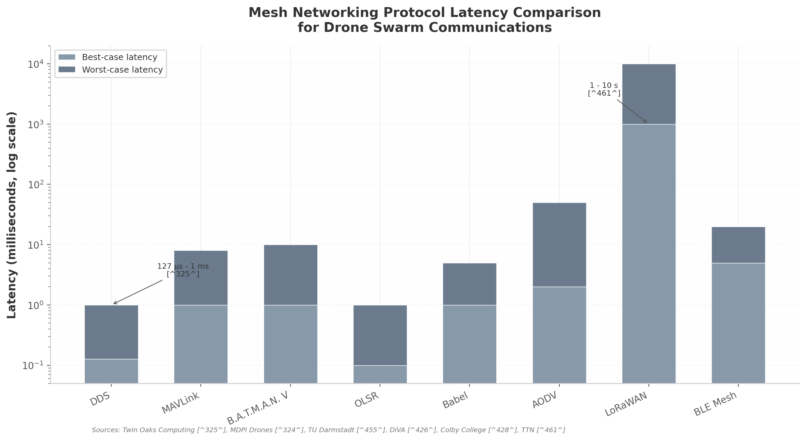
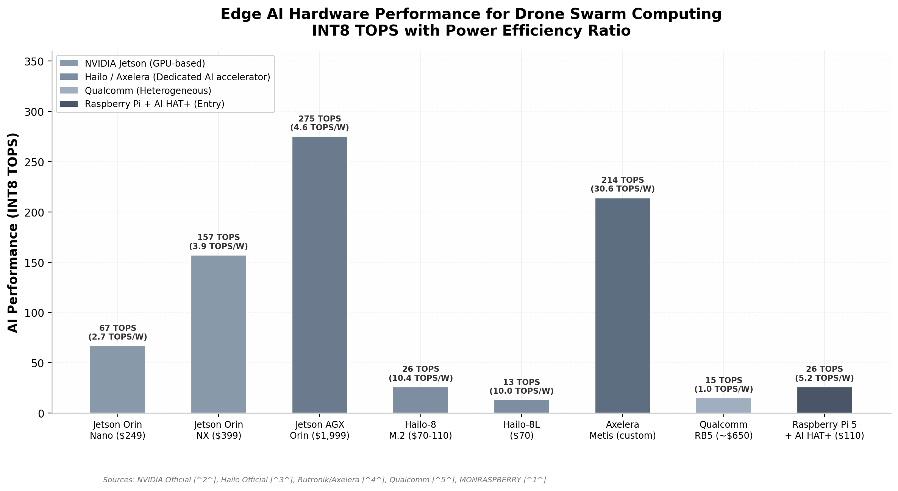

# Military Robotics & AI Drone Market — Technology Feasibility

**Date:** 2026-07-03  
**Purpose:** Assess whether Operator's four-pillar stack (swarm coordination, gossip/mesh networking, edge AI, 3D hex visualization, portable C2) is buildable now.

---

## Verdict

All four pillars are **independently proven** in research, commercial products, or military deployments. The innovation is integration, not invention.

---

## 1. Drone swarm architecture

### Six coordination architectures compared

| Architecture | Control model | Scalability | Resilience | Latency | Complexity | Best use case | Maturity |
|--------------|---------------|-------------|------------|---------|------------|---------------|----------|
| Centralized | Single controller | 10–30 | Low | <100 ms | Low | Small critical missions | Deployed |
| Leader-follower | Elected leader | 50–100 | Medium | <200 ms | Low | Formation flight, ISR | Deployed |
| Hierarchical | Multi-level tree | 100–500 | Medium | <1 s | Medium | Multi-echelon ops | Emerging |
| Distributed consensus | Peer voting (Raft/PBFT) | 100–1,000+ | High | <2.5 s | High | GNSS-degraded, contested | Validated |
| **Gossip / epidemic** | Random peer exchange | 1,000+ | Very high | 10–100 ms | Low | Large dynamic swarms | **Validated** |
| Blockchain-backed | Smart contracts | 10–200 | Very high | 12.4 ms + block | Very high | Secure audit trails | Research |

**Why gossip fits Operator:** no single point of failure, sub-linear per-node overhead, graceful degradation under jamming or node loss.

### Field evidence

- **DARPA OFFSET (2017–2021):** 300+ heterogeneous platforms supervised by a single human; immersive C2 via VR, AR, sketch tablets, and mobile phones.
- **Ukraine Swarmer:** 100,000+ combat missions; one operator controls up to 7 drones, targeting 100-drone simultaneous operation.
- **Turkey KARGU (May 2026):** world's first live-fire swarm drone strike; loitering munitions split into sub-groups under single-operator control without a central node.
- **DiRAC framework:** real-time performance across 1,000+ agents with ROS 2 integration.
- **UATG framework:** coordinates 1,588 drones in ~5 seconds on standard laptop hardware.

**So what for Operator:** the technology to coordinate 100+ agents exists. The binding constraint is sim-to-real transfer, not algorithmic scalability. Start with 5–20 agents, target 20–50 in field testing by month 12.

---

## 2. Mesh networking & gossip protocols — the moat

### Gossip protocol benefits

- **35–53% energy savings** vs. flooding in mobile ad hoc networks.
- **Sub-linear per-node overhead** — O(log n) convergence rounds.
- **Natural fault tolerance** — no central coordinator; dynamic join/leave.
- **Epidemic state propagation** — information reaches all surviving nodes even when 50% are jammed or destroyed.

### Protocol stack comparison

| Protocol | Latency | Bandwidth | Range | Scalability | Mobility | Energy | Military provenance |
|----------|---------|-----------|-------|-------------|----------|--------|---------------------|
| **DDS** | 127 μs – 1 ms | High | Network-dependent | 1,000+ | Excellent | Medium | Aegis, JBC-P, LCS |
| **MAVLink** | 1–8 ms | Low | Link-dependent | ~50 | Poor | Low | FCU telemetry |
| **B.A.T.M.A.N. V** | 1–10 ms | 1–3 Mbps | Multi-hop | 100+ | Excellent | Medium | Community mesh, UAV-evaluated |
| **OLSR** | 0.1–1 ms | 1–3 Mbps | Multi-hop | 100+ | Good | Medium | Most studied for UAVs |
| **Babel** | 1–5 ms | 1–2 Mbps | Multi-hop | 100+ | Excellent | Low | Emerging FANETs |
| **LoRaWAN** | 1–10 s | 0.3–50 kbps | 10+ km | 1,000+ | N/A | Very low | Long-range telemetry backup |
| **FHSS/SDR** | 1–10 ms | 7.5+ Mbps | Variable | 100+ | Excellent | Medium | Defense-grade anti-jam |

### Recommended stack

- **Application layer:** gossip protocol for state synchronization.
- **Middleware:** ROS 2 + DDS for low-latency peer-to-peer messaging (with fallback for lossy RF links).
- **Network layer:** B.A.T.M.A.N. V or OLSR for mesh routing.
- **Physical/link layer:** cognitive SDR with FHSS anti-jamming (2,000+ hops/s).
- **Fallback:** Delay-Tolerant Networking (DTN) store-carry-and-forward for partitioned networks.

**Caveat:** DDS over lossy RF performs poorly due to UDP fragmentation. Use DDS for intra-swarm companion-computer messaging, with a lower-layer mesh protocol handling radio resilience.

---

## 3. Edge AI on drones

### Hardware platforms

| Platform | INT8 perf. | Power | TOPS/W | Price | Best for |
|----------|------------|-------|--------|-------|----------|
| Jetson Orin Nano (8GB) | 34–67 TOPS | 7–25 W | 2.7 | $249 | Entry AI, single model |
| Jetson Orin NX (16GB) | 100–157 TOPS | 10–40 W | 3.9 | $399 | Multi-model, advanced robotics |
| Jetson AGX Orin (64GB) | 200–275 TOPS | 15–60 W | 4.6 | $1,999 | Multi-camera, LLM, full autonomy |
| Hailo-8 M.2 | 26 TOPS | 2.5 W | 10.4 | $70–110 | Dedicated accelerator, no external DRAM |
| Hailo-8L | 13 TOPS | ~1.3 W | 10.0 | $70 | Entry-level, cost-efficient |
| Axelera Metis M.2 | 214 TOPS | 5–9 W | 24–30 | Custom | Highest efficiency, drone AI |

### Object detection benchmarks

- **YOLOv8n on Jetson Orin Nano:** 33.2 FPS at ~12 ms end-to-end latency (C++ + TensorRT FP16).
- **YOLO11n:** 4.57 ms inference latency on Orin Nano.
- **TensorRT FP16:** 50–65% latency reduction vs. PyTorch.
- **INT8 quantization:** 3.3x model compression; accuracy degradation ~12.5% mAP50 — acceptable for many ISR tasks.

### GPS-denied navigation

- **ORB-SLAM3 + RTAB-Map:** stereo + IMU fusion on Jetson Orin.
- **Sensor fusion (camera + IMU + LiDAR + depth):** drift <0.4m, mapping RMSE 0.13m.

### Small language models on the edge

- **1–4B parameter models:** 10–40 tok/s on Jetson Orin (LLaMA.cpp).
- **Phi-3.5-mini (3.8B):** 24.7–46.9 tok/s across Orin range.
- **SmolLM2 (1.7B):** 41.0–64.5 tok/s on Orin Nano.
- Models >8B see TTFT grow to 30–40 seconds — impractical for real-time decisions.

**So what for Operator:** real-time target detection, GPS-denied navigation, and onboard semantic reasoning are deployable today for under $250 per agent.

---

## 4. 3D hexagonal tactical map — the differentiator

### Recommended stack

- **Cesium.js** — 3D globe and terrain rendering; WGS84 ellipsoid for geodetic accuracy; self-hosted terrain tiles for classified networks.
- **H3-js** — Uber's hexagonal geospatial indexing; hierarchical resolutions 0–15; single 64-bit cell IDs.
- **Three.js** — custom WebGL shaders for high track counts.

### Why hex grids matter for tactical analysis

1. All six adjacent cells are equidistant — no diagonal distortion.
2. ~15% less perimeter than squares for the same area — efficient search/patrol coverage.
3. Naturally approximate circular sensor/weapon envelopes.
4. Standard pathfinding (Dijkstra/A*), elevation-aware LOS, and fog-of-war per cell are well supported.
5. Familiar to military users from wargaming and simulations.
6. Extend naturally into volumetric hexagonal prisms for airspace layers and elevation bands.

### Rendering performance

- **Cesium Entity API:** ~12 FPS at 5,000 tracks.
- **Cesium Primitive API + instancing:** ~28 FPS at 10,000 tracks.
- **Custom WebGL shaders (Three.js):** 50,000 tracks feasible with batched 1 Hz updates.

### Competitive gap

No existing BMS integrates 3D hex visualization:

- **SitaWare HQ / NATO Project DEMETER:** 2D primary, IOC March 2025.
- **ATAK:** 3D perspective views but standard overlays, no hex tessellation, client-server architecture.
- **Palantir TITAN:** multi-domain sensor fusion, not display-geometry innovation.

**So what for Operator:** 3D hex is a category creator, not a feature improvement. Build a working prototype in months, not years.

---

## 5. Portable C2 — the untapped tactical edge

### Gap analysis

| System | Vendor | Form factor | Unit of command | 3D viz | Gossip | Deployability |
|--------|--------|-------------|-----------------|--------|--------|---------------|
| TITAN | Palantir | FMTV/JLTV truck | Division/Brigade | Partial | No | Vehicle-mounted only |
| Lattice | Anduril | Infrastructure-grade | Theater | Partial | No | Fixed/vehicle |
| SitaWare HQ | Systematic | Command post | Brigade+ | 2D primary | No | Static CP |
| ATAK | US DoD | Android tablet | Squad/Platoon | 3D perspective | No | Dismounted, proven |
| **Operator** | — | **Tablet + backpack** | **Fire team/Platoon** | **3D hex** | **Yes** | **Fully portable** |

### Platoon-level opportunity

A single soldier with a rugged tablet commanding 10–50 agents. Ukraine's Swarmer and DARPA OFFSET prove this model. Required hardware:

- Ruggedized tablet (e.g., Samsung Galaxy Tab Active class).
- Mesh radio attachment (SDR + LoRa backup).
- Backpackable compute node (Raspberry Pi 4/5 + B.A.T.M.A.N. V + battery + directional antenna).

**So what for Operator:** every major competitor builds for the Pentagon; no one builds for the platoon. The technology is commercial, the protocols are open-source, and the operational need is immediate.

---

## 6. R&D readiness summary

| Component | Readiness | Gap | Mitigation timeline |
|-----------|-----------|-----|---------------------|
| Gossip protocol (5–20 agents) | High | None | 0–3 months |
| Gossip protocol (50–100+ agents) | Medium | Zone-based hierarchy | 6–12 months |
| DDS middleware | High | RF datalink fragility | 0–3 months (layered architecture) |
| Edge AI (YOLO detection) | High | Thermal throttling in compact airframes | 0–3 months |
| Edge AI (small LLM reasoning) | Medium | Stay with 1–4B models | 3–6 months |
| SLAM (GPS-denied nav) | High | Collaborative multi-agent SLAM | 6–12 months |
| 3D hex map (brigade level, <2K tracks) | High | None | 3–6 months |
| 3D hex map (theater level, 50K tracks) | Medium | Custom WebGL shaders | 6–18 months |
| Portable C2 (tablet) | High | Integration with gossip + hex viz | 3–6 months |
| Anti-jamming (FHSS) | High | Integration with gossip | 3–6 months |
| Blockchain security | Low | Adds 12.4 ms latency; optional Phase 2 | 12–24 months |

---

## Recommended development sequence

1. **Months 0–3:** Gossip-based coordination on 5-agent Raspberry Pi network; DDS middleware integration; basic Cesium.js hex map.
2. **Months 3–6:** 3D hex visualization populated by mock/live agent telemetry; YOLOv8n edge detection on Jetson Orin Nano.
3. **Months 6–12:** Portable tablet C2 hardened; outdoor field tests with 10–20 agents; zone-based clustering for scaling.
4. **Months 12–18:** 50+ agent field validation; collaborative SLAM; theater-level track rendering.

---

## Bottom line

Operator's stack is not science fiction. The components are commercially available and validated in adjacent deployments. The defensible work is integrating them into a single platform and proving it in the field faster than incumbents can copy.
