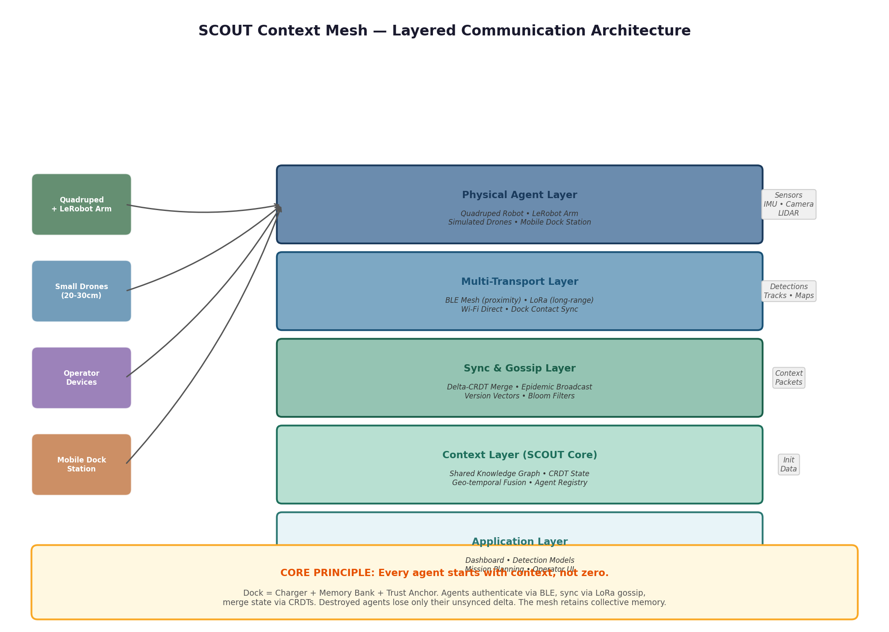
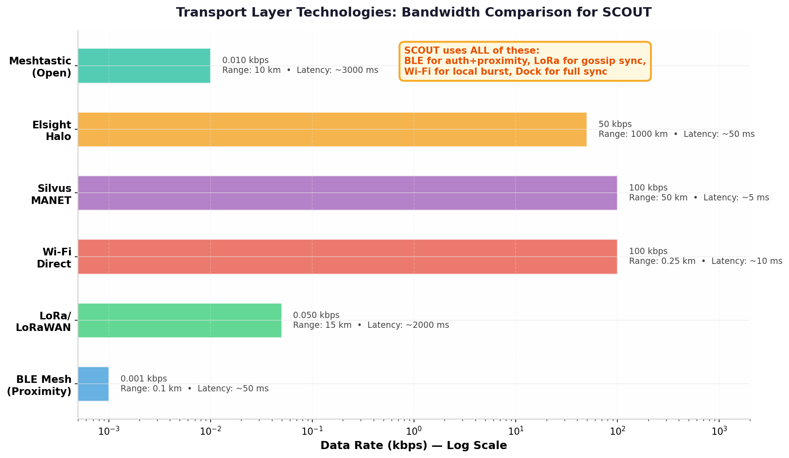
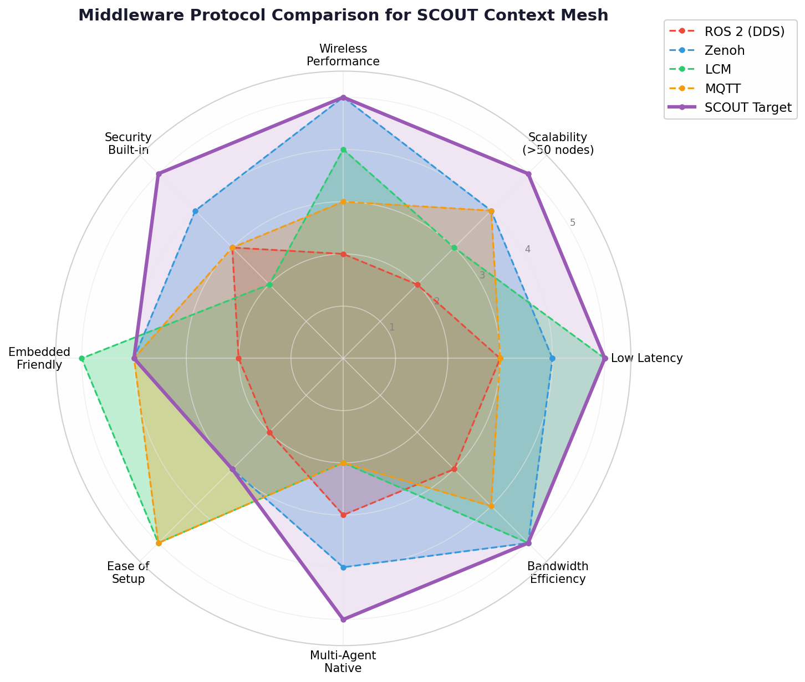

# SCOUT Context Mesh: Deep-Dive Research Brief
## Distributed Agent Communication, Shared Mission Memory & the Charging Station as Context Initializer

**TL;DR:** The biggest strategic opportunity for SCOUT at the Berlin Defense Tech Hackathon is **not hardware** — it is a **software layer that lets heterogeneous agents (drones, quadruped, operator devices) share mission context** so that every agent starts with knowledge, not zero. This research maps the full technology landscape: BLE mesh for proximity authentication, LoRa for low-bandwidth gossip sync, **CRDTs (Conflict-free Replicated Data Types)** for distributed state convergence without a central server, and the **charging station as a context cache + trust anchor** that initializes new agents with the collective memory of the swarm. No existing open-source project combines these four elements. The gap is real, the technology is ready, and the hackathon challenge (Geo-Temporal Fusion Engine, 3D Graph Exploration) maps directly onto this architecture.

---

## 1. The Strategic Gap: Why Context Mesh Is the Moat

Current drone/robot systems suffer from a fundamental memory problem. Every agent boots with zero context about the mission, the environment, or what other agents have already discovered. A drone that returns for battery swap launches again as a blank slate. A ground robot entering a building has no knowledge of what aerial drones mapped an hour ago. Operators in different squads run parallel, non-communicating missions. This is not a hardware limitation — it is an **architectural blind spot** in how multi-agent systems share knowledge.

The market has recognized this. Anduril's Lattice platform (valued at **$61 billion** as of May 2026) integrates hardware, sensors, and C2 software into a vertical stack where platform-level switching costs accumulate through the Lattice integration layer  [(UAS Detection, Defeat & Procurement)](https://droneintelligence.ai/compare/anduril-vs-shield-ai) . Shield AI's Hivemind takes the opposite approach — a platform-agnostic autonomy stack designed to make any drone autonomously useful in GPS-denied environments, with the V-BAT drone existing primarily as a delivery vehicle for the autonomy software  [(UAS Detection, Defeat & Procurement)](https://droneintelligence.ai/compare/anduril-vs-shield-ai) . L3Harris's **AMORPHOUS** program explicitly targets this gap: a C2 software architecture for "thousands" of autonomous systems under a single digital backbone, where "a command would be passed to the swarm, and then members of the swarm would communicate with one another, and they would determine how to jointly accomplish" missions — with peer swarm members filling gaps when one drops out  [(Janes)](https://www.janes.com/defence-intelligence-insights/defence-news/air/l3harris-amorphous-software-targets-drone-swarm-c2-capability) .

The key insight from this research is that **all of these solutions are proprietary, centralized, or both**. Lattice requires Anduril hardware. Hivemind is autonomy software, not a context-sharing mesh. AMORPHOUS is a military program, not an open architecture. What does not exist — and what SCOUT can own — is an **open, decentralized context layer** that works across heterogeneous agents without requiring a central server, persistent cloud connectivity, or proprietary hardware lock-in. The moat is not the robot. The moat is the **shared memory fabric** that makes any robot smarter the moment it joins the team.

---

## 2. The SCOUT Context Mesh Architecture

The proposed architecture consists of five layers, each addressing a specific communication challenge. The design principle is **progressive disclosure**: the most critical data travels over the lowest-bandwidth, most resilient links, while rich data transfers only when high-bandwidth opportunities arise.

### 2.1 Physical Agent Layer

SCOUT's current hardware inventory — a **quadruped robot with a LeRobot arm**, small simulated drones (20-30cm), and the concept of a mobile dock station — maps cleanly onto heterogeneous multi-agent systems research. The quadruped serves as a ground scout capable of entering buildings, traversing rough terrain, and manipulating objects with the LeRobot arm. Small drones provide aerial reconnaissance, rapid area coverage, and overwatch. The dock station is not merely a charger: it becomes a **context cache, trust anchor, and mission initializer** — the physical embodiment of the swarm's collective memory.

This heterogeneity is a feature, not a bug. The research on ROS 2 multi-robot systems highlights that heterogeneous environments (UAVs + UGVs) present specific synchronization challenges due to varying communication protocols and robot velocities  [(Preprints)](https://www.preprints.org/manuscript/202410.1204/v2) . The SCOUT architecture turns this challenge into a differentiation: agents with different capabilities, compute budgets, and mobility profiles must all participate in the same shared context fabric.

### 2.2 Multi-Transport Layer

No single communication technology satisfies all requirements. The SCOUT mesh uses **four complementary transports**, selected dynamically based on agent proximity, available bandwidth, and mission phase:

| Transport | Role | Bandwidth | Range | Latency | Security |
|-----------|------|-----------|-------|---------|----------|
| **BLE Mesh** | Proximity handshake, identity verification, small context packet exchange | ~1 kbps  [(Applied Computer Science (ACS))](https://acs.pollub.pl/pdf/v21n3/9.pdf)  | ~100m | ~50ms | AES-128 built-in  [(arXiv.org)](https://arxiv.org/pdf/2107.05563)  |
| **LoRa/LoRaWAN** | Gossip sync, heartbeat, map-cell updates, alerts | 0.3-50 kbps  [(Applied Computer Science (ACS))](https://acs.pollub.pl/pdf/v21n3/9.pdf)  | Up to 15km  [(Applied Computer Science (ACS))](https://acs.pollub.pl/pdf/v21n3/9.pdf)  | ~2s | AES-128, pre-shared keys |
| **Wi-Fi Direct / 802.11ah** | Burst transfer of maps, keyframes, detection batches | Up to 100 Mbps  [(Applied Computer Science (ACS))](https://acs.pollub.pl/pdf/v21n3/9.pdf)  | ~250m | ~10ms | WPA3 |
| **Dock Contact** | Full state sync, trust anchor validation, mission initialization | Unbounded (wired) | Contact only | <1ms | Physical trust boundary |

This multi-transport approach mirrors battle-proven military architectures. The Meshtastic + ATAK integration exercise with **300+ concurrent devices** in a simulated border conflict used LoRa for text/GPS mesh communication, Starlink for high-bandwidth backhaul, and vehicle gateways to bridge the two — achieving successful scaling by offloading heavy data to satellite while keeping the mesh free for vital updates  [(Defencebay)](https://defencebay.com/blog/off-grid-tactical-comms-on-the-battlefield-meshtastic-and-atak-integration-in-a-border-conflict-exercise) . Rajant's InstaMesh protocol similarly creates a unified adaptive network across diverse transports (SATCOM, legacy radios, LTE/5G), routing traffic through the strongest available path at any moment  [(Rajant Corporation)](https://rajant.com/blog/forward-edge-networking-why-mesh-over-everything-matters-in-contested-environments/) . Elsight's Halo platform bonds LTE/5G, satellite, and RF links into a single virtual pipeline with **>99.98% connection uptime** through AI-powered network switching  [(elsight.com)](https://www.elsight.com/products/) .

The SCOUT innovation is applying this multi-transport philosophy **at the software layer** with commodity hardware, rather than requiring specialized military radios.

### 2.3 Sync & Gossip Layer: CRDTs as the Foundation

The critical technical decision for distributed context sharing is **how to merge state across agents without a central server**. After evaluating multiple approaches, the research strongly points to **Conflict-free Replicated Data Types (CRDTs)** as the optimal foundation.

CRDTs are abstract data types that guarantee **Strong Eventual Consistency (SEC)** — meaning any two replicas that have received the same set of updates will converge to the same state, without requiring coordination or consensus  [(Inria)](https://inria.hal.science/hal-00932836v1/document) . This property makes them ideal for mesh networks where:

- **No central coordinator exists** (no single point of failure)  [(Pask Software)](https://pasksoftware.com/crdts/) 
- **Network partitions are normal** (agents move in and out of range)
- **Nodes fail unpredictably** (drones get destroyed, robots lose power)
- **Communication is asynchronous** (no guarantee of message order)

There are three CRDT variants relevant to SCOUT:

| CRDT Type | What It Sends | Network Requirements | Best For |
|-----------|--------------|---------------------|----------|
| **State-based (CvRDT)** | Full local state | Tolerates message loss/duplication | Small state objects |
| **Operation-based (CmRDT)** | Only operations | Requires reliable causal broadcast | Large state, frequent updates |
| **Delta-state (δ-CRDT)** | Only state changes (deltas) | Tolerates unreliable networks  [(UCSB Computer Science)](https://cs.ucsb.edu/sites/default/files/documents/paper_9.pdf)  | **SCOUT's optimal choice** |

Delta-state CRDTs (δ-CRDTs) combine the advantages of both approaches: they communicate only state changes rather than full state, but do not require exactly-once causal broadcast  [(UCSB Computer Science)](https://cs.ucsb.edu/sites/default/files/documents/paper_9.pdf) . For SCOUT, this means an agent can broadcast a small delta like "cell (x,y) on the map changed from unknown to occupied at time T" rather than the entire map. Other agents merge this delta into their local state using a mathematically guaranteed merge function. When two agents meet, they exchange only the deltas each has missed — a process naturally suited to **gossip/epidemic broadcast** where information spreads through the mesh like a virus  [(Pask Software)](https://pasksoftware.com/crdts/) .

The research on securing federated learning in robot swarms using blockchain highlights an important adjacent concern: Byzantine fault tolerance. CRDTs alone cannot handle malicious nodes that send malformed states  [(Pask Software)](https://pasksoftware.com/crdts/) . For the hackathon scope, this is acceptable (assume non-Byzantine agents), but production deployments should consider Martin Kleppmann's work on making CRDTs Byzantine fault-tolerant or using lightweight blockchain verification as explored in swarm robotics research  [(giovannireina.com)](https://www.giovannireina.com/pdf/Pacheco-DARS-2024.pdf) .

### 2.4 Context Layer (SCOUT Core)

The context layer maintains a **shared knowledge graph** representing the collective understanding of the operational environment. Each agent holds a local replica of this graph, implemented as a collection of CRDTs:

- **Occupancy grid maps** (δ-CRDT counters per cell)
- **Agent registries** (CRDT sets of active/inactive agents with metadata)
- **Detection tracks** (CRDT sequences of observed objects with timestamps, confidence, classification)
- **Mission parameters** (CRDT registers for waypoints, zones, priorities)
- **Communication graphs** (CRDT graphs representing which agents have recently synced)

This approach directly addresses the **Geo-Temporal Fusion Engine** challenge from the Munich/Berlin hackathon: "Design and prototype a data fusion engine that ingests relational intelligence data from multiple sources and produces a unified, filterable timeline of events for any selected area on a hex-grid map" [from user chat]. The CRDT-based knowledge graph is precisely such a fusion engine — decentralized, resilient, and naturally producing a geo-temporal timeline as each observation is timestamped and spatially indexed.

### 2.5 Application Layer

The application layer exposes the shared context to operators and higher-level autonomy systems. A tactical dashboard displays the merged knowledge graph: a map with occupancy probabilities, detected object tracks with confidence decay over time, agent positions and health status, and a filterable timeline of events. Detection models running on edge (YOLO-family networks optimized for the drone/robot camera feeds) produce observations that feed into the context layer as new CRDT deltas.

The dashboard serves dual purposes: it is both the operator's situational awareness display and the **demo's visual centerpiece**. Judges and investors need to see the context mesh working in real-time — agents moving, detecting, syncing, and the dock's memory growing. The visual story of "every agent starts with context" is more compelling than any technical specification.

---

## 3. CRDT Implementation: How SCOUT Actually Builds This

The theoretical foundation of CRDTs is well-established  [(Inria)](https://inria.hal.science/hal-00932836v1/document) , but implementing a production-quality δ-CRDT system for embedded robotic agents requires specific architectural decisions. This section translates the research into actionable engineering guidance.

### 3.1 δ-CRDT State Types for SCOUT

Each type of shared context requires a different CRDT data structure, chosen to match the update patterns and merge semantics:

| Context Type | CRDT Type | Merge Operation | Size per Delta | Update Pattern |
|-------------|-----------|-----------------|----------------|----------------|
| **Map cell occupancy** | G-Counter (increment-only) | Max of replica values  [(wikipedia.org)](https://en.wikipedia.org/wiki/Conflict-free_replicated_data_type)  | 8 bytes | Increment when observed |
| **Agent registry** | OR-Set (observed-remove set) | Union of adds minus union of removes  [(wikipedia.org)](https://en.wikipedia.org/wiki/Conflict-free_replicated_data_type)  | ~50 bytes | Add on join, remove on timeout |
| **Detection tracks** | Sequence CRDT (RGA/LSEQ) | Concatenate with tie-breaking  [(Ably Realtime)](https://ably.com/blog/crdts-distributed-data-consistency-challenges)  | ~100 bytes | Append new observations |
| **Mission waypoints** | LWW-Register (last-write-wins) | Timestamp comparison  [(wikipedia.org)](https://en.wikipedia.org/wiki/Conflict-free_replicated_data_type)  | ~30 bytes | Overwrite on update |
| **Communication graph** | Grow-only graph | Edge union  [(Inria)](https://inria.hal.science/hal-00932836v1/document)  | ~20 bytes/edge | Add edge on successful sync |

The Grow-only Counter (G-Counter) for map cells is particularly elegant: each agent maintains a vector of per-replica counts. To merge, take the element-wise maximum. A cell's occupancy confidence is proportional to its counter value. This provides probabilistic occupancy mapping without requiring a central map server — exactly what the Geo-Temporal Fusion Engine challenge demands.

### 3.2 The Gossip Protocol

SCOUT's gossip protocol follows the epidemic broadcast pattern: each agent periodically selects a random peer and exchanges a summary of its state (using Bloom filters to represent the set of known deltas efficiently). The peer responds with deltas it has that the requesting agent lacks, and vice versa. This converges exponentially fast — after O(log N) rounds, all agents have all updates  [(Pask Software)](https://pasksoftware.com/crdts/) .

For bandwidth-constrained LoRa links, the protocol implements **adaptive gossip rate**: agents gossip more frequently when they detect high activity (many new detections, map changes) and throttle back during quiet periods. The dock acts as a "super-peer" that gossips with all agents, accelerating convergence by serving as a central meeting point without being a single point of failure (agents can still sync peer-to-peer if the dock is unavailable).

### 3.3 Version Vectors and Delta Deduplication

Each delta carries a **version vector** — a map of {agent_id: sequence_number} that identifies exactly which agent produced the update and in what order. When an agent receives a delta, it checks its local version vector: if the sequence number is newer than what it has stored for that agent, the delta is applied; otherwise, it is discarded as a duplicate  [(UCSB Computer Science)](https://cs.ucsb.edu/sites/default/files/documents/paper_9.pdf) .

This deduplication is critical for LoRa networks where packet duplication is common. The version vector also enables **causal consistency**: an agent can determine whether it has received all deltas that causally precede a given update, ensuring that map cells are not marked occupied before the agent that observed them has been registered in the agent registry.

### 3.4 State Compaction and Garbage Collection

Unbounded CRDT state growth is a real concern for memory-constrained embedded agents. SCOUT implements two compaction strategies:

**Spatial pruning**: Map cells outside the current operational area are aggregated (merged into a lower-resolution representation) and eventually tombstoned. If an agent re-enters a pruned area, it requests the aggregated state from the dock or peers.

**Tombstone garbage collection**: Remove operations in OR-Sets generate tombstones that must be retained to prevent re-addition of removed elements. After a configurable timeout (e.g., 24 hours), tombstones are garbage-collected, trading perfect consistency for bounded memory usage. This is acceptable for tactical scenarios where stale data has limited value anyway.

---

## 3. Middleware Protocol Analysis

Selecting the right communication middleware is critical for SCOUT's performance. This research evaluated five protocols across eight dimensions:

### 3.1 ROS 2 with DDS

ROS 2 uses DDS (Data Distribution Service) as its default middleware, which provides discovery, QoS, and real-time communication. However, research reveals severe scalability limitations: with **100 nodes, ROS 2 exhibits maximum latencies exceeding 6 minutes** (412,285 ms), compared to under 9 seconds for optimized protocols  [(The Science and Information (SAI) Organization)](https://thesai.org/Downloads/Volume12No11/Paper_31-Real_Time_Distributed_and_Decentralized_Peer_to_Peer_Protocol.pdf) . In UAV swarm simulations, DDS implementations (Fast DDS, Cyclone DDS, Connext DDS) all degrade below **80% communication success rate** when more than 4-7 UAVs are active concurrently  [(MDPI)](https://www.mdpi.com/2504-446X/9/8/564) .

ROS 2 also requires significant memory and CPU overhead, making it unsuitable for the smallest drones and embedded agents in SCOUT's fleet. The security features (SROS2) introduce additional performance overhead  [(arXiv.org)](https://arxiv.org/pdf/2309.07496) .

**Verdict for SCOUT:** Useful for the quadruped's onboard processing and high-level planning, but **not suitable as the swarm mesh protocol**.

### 3.2 Zenoh

Zenoh is emerging as the strongest ROS 2 alternative for distributed systems. Research shows Zenoh **outperforms DDS on Wi-Fi and 4G networks** (the conditions SCOUT will face) with lower latency and better throughput  [(arXiv.org)](https://arxiv.org/pdf/2309.07496) . On a real TurtleBot 4 platform, Zenoh demonstrated the **smallest trajectory drift error over 96 seconds** of operation, indicating more reliable control  [(arXiv.org)](https://arxiv.org/pdf/2309.07496) . Zenoh's gossip-based discovery generates lower initial network load than DDS's broadcast-heavy approach  [(MDPI)](https://www.mdpi.com/2504-446X/9/8/564) .

Zenoh is being actively integrated into ROS 2 as an alternative RMW (Robot Middleware Wrapper), with the ROS 2 TSC working to include it in future releases  [(arXiv.org)](https://arxiv.org/pdf/2309.07496) . It supports bridging to MQTT, DDS, and other protocols, making it ideal as a "glue" layer in heterogeneous systems.

**Verdict for SCOUT:** Strong candidate for the **high-level inter-agent communication backbone**, especially between the quadruped, operator devices, and dock station.

### 3.3 LCM (Lightweight Communications and Marshalling)

LCM was developed at MIT for the DARPA Robotics Challenge and powers MIT's Cheetah and Mini Cheetah robots. It offers **~50-100µs loopback latency** (4-10x faster than DDS) and **10-20µs LAN latency**  [(RoboCloud Hub - Learn Robotics Online)](https://robocloud-dashboard.vercel.app/learn/blog/robot-middleware-comparison) . LCM uses UDP multicast — one packet, everyone who cares receives it — with minimal overhead and code generation from .lcm message definitions.

A robotics practitioner reported: "We built an autonomous drone using ROS 2 with default settings... WiFi interference caused DDS discovery to fail randomly. The drone would lose half its sensor streams mid-flight and crash. After switching the critical control loop to LCM, fixed. Never crashed again"  [(RoboCloud Hub - Learn Robotics Online)](https://robocloud-dashboard.vercel.app/learn/blog/robot-middleware-comparison) .

**Verdict for SCOUT:** Ideal for the **quadruped's inner control loop** and any scenario requiring sub-millisecond reaction times. Not suitable for multi-hop mesh networking.

### 3.4 MQTT

MQTT is a lightweight publish-subscribe protocol designed for IoT. It excels in ease of setup and works well over intermittent networks, but requires a broker (centralized architecture) and lacks native multi-agent discovery. Research shows MQTT has higher latency than Zenoh in wireless conditions and introduces trajectory drift in robot control applications  [(arXiv.org)](https://arxiv.org/pdf/2309.07496) .

**Verdict for SCOUT:** Useful for dock-to-cloud telemetry if needed, but **not suitable for the decentralized mesh**.

### 3.5 Custom Protocol (SCOUT's Path)

The research points to a **hybrid approach**: use LCM for the quadruped's onboard real-time control, Zenoh for inter-agent communication between compute-capable nodes, and a **custom lightweight gossip protocol** over LoRa for the swarm-wide context sync. The custom protocol implements δ-CRDT merge logic in C++ or Rust, with BLE mesh for proximity discovery and authentication.

This hybrid mirrors what high-performance robotics companies actually do. Boston Dynamics, ANYmal, and Agility Robotics all use **hybrid architectures**: ROS 2 for high-level perception and planning, custom lightweight middleware (often LCM or raw shared memory) for the inner control loop running at kHz  [(RoboCloud Hub - Learn Robotics Online)](https://robocloud-dashboard.vercel.app/learn/blog/robot-middleware-comparison) .

---

## 4. C2 Platform Landscape: Where SCOUT Fits

Understanding the competitive C2 ecosystem is essential for positioning SCOUT's context mesh as a differentiated, open alternative.

| Platform | Company | Approach | Scale | Key Feature | Limitation |
|----------|---------|----------|-------|-------------|------------|
| **Lattice** | Anduril ($61B)  [(UAS Detection, Defeat & Procurement)](https://droneintelligence.ai/compare/anduril-vs-shield-ai)  | Vertical integration: hardware + sensors + C2 software | Platform-level | Multi-decade integration platform | Proprietary, hardware-locked |
| **Hivemind** | Shield AI ($12.7B)  [(UAS Detection, Defeat & Procurement)](https://droneintelligence.ai/compare/anduril-vs-shield-ai)  | Horizontal autonomy: platform-agnostic AI navigation | Any drone | GPS-denied autonomy | Autonomy only, no context sharing |
| **AMORPHOUS** | L3Harris  [(Janes)](https://www.janes.com/defence-intelligence-insights/defence-news/air/l3harris-amorphous-software-targets-drone-swarm-c2-capability)  | Military C2 for swarms | "Thousands" of systems | Smart swarm tech, data mesh construct | Classified/military program |
| **Kinetic Mesh** | Rajant  [(Rajant Corporation)](https://rajant.com/blog/forward-edge-networking-why-mesh-over-everything-matters-in-contested-environments/)  | Mesh-over-everything networking | Hundreds of nodes | InstaMesh protocol, no central controller | Hardware radios required |
| **StreamCaster** | Silvus/Motorola  [(Motorola Solutions)](https://www.motorolasolutions.com/newsroom/press-releases/silvus-technologies-launches-streamcaster-nexus.html)  | MANET MIMO radios | Hundreds of nodes | 100 Mbps, LPI/LPD, AES256 | $10K+ per radio unit |
| **TAK/ATAK** | US Gov (tak.gov)  [(TAK.gov)](https://tak.gov/)  | Situational awareness suite | 300+ clients  [(Defencebay)](https://defencebay.com/blog/off-grid-tactical-comms-on-the-battlefield-meshtastic-and-atak-integration-in-a-border-conflict-exercise)  | Open-source client, CoT protocol | Requires TAK Server for cross-network |
| **SCOUT Context Mesh** | **SCOUT (you)** | **Open, decentralized context layer** | **10-100 agents** | **CRDT-based, no server, no cloud** | **Early stage — this is the opportunity** |

The gap in this landscape is clear: there is **no open-source, decentralized context-sharing layer** for heterogeneous robotic teams. Anduril owns the vertical stack. Shield AI owns autonomy. L3Harris owns military C2. Rajant and Silvus own the radio hardware. TAK provides situational awareness but requires a server and is primarily a display tool, not a mesh sync engine. SCOUT's opportunity is to own the **context fabric** that sits between all of these — open, portable, and hardware-agnostic.

---

## 5. GPS-Denied Navigation: Context for Position

GPS denial is a core challenge in the Berlin hackathon challenges (Event-Based GPS-Denied Visual Navigation, Thermal Map Matching). While SCOUT's primary focus is the context mesh, understanding GPS-denied alternatives is critical because **position uncertainty directly affects context quality**.

### 5.1 Visual SLAM (V-SLAM)

Recent research compared five V-SLAM systems across classical, deep learning, recurrent, and Vision Transformer paradigms  [(arXiv.org)](https://arxiv.org/abs/2605.03678) :

| System | Paradigm | Degraded ATE | Tracking Success | FPS | GPU Memory | Embedded Suitability |
|--------|----------|-------------|------------------|-----|------------|---------------------|
| ORB-SLAM3 | Classical | Fails critically (62.4% TSR) | 0% under dense haze | — | — | Poor |
| DPVO | Deep learning | Moderate | 86.1% | **18.6** | **3.1 GB** | **Best for constrained** |
| DROID-SLAM | Deep learning | Good | 96.5% | Low | High | Moderate |
| DUSt3R | ViT | Good | **96.5%** | Low | Very high | Poor |
| MASt3R | ViT | **0.027m** (lowest) | High | Low | Very high | Poor |

**Key finding:** DPVO offers the best efficiency-robustness trade-off for memory-constrained embedded platforms (like the NVIDIA Jetson Orin Nano used in GPS-denied UAV projects  [(andrewbernas.com)](https://www.andrewbernas.com/docs/projects/robots/vslam) ), making it the preferred choice for SWaP-constrained UAV scenarios  [(arXiv.org)](https://arxiv.org/abs/2605.03678) .

### 5.2 Event Cameras

Event cameras provide microsecond temporal resolution and high dynamic range, making them ideal for fast autonomous sensing in UAVs  [(MDPI)](https://www.mdpi.com/1424-8220/26/1/81) . Research demonstrates event-based VIO achieving **5-10ms processing latency per event batch**, compared to 15-30ms per frame for keyframe-based systems  [(nih.gov)](https://pmc.ncbi.nlm.nih.gov/articles/PMC11722967/) . The trade-off is immature simulation platforms and limited real-world validation datasets  [(MDPI)](https://www.mdpi.com/1424-8220/26/1/81) .

**Verdict for SCOUT:** GPS-denied navigation is a **parallel track**, not the core thesis. The quadruped can use Intel RealSense + Isaac ROS VSLAM (as demonstrated in recent UAV projects  [(andrewbernas.com)](https://www.andrewbernas.com/docs/projects/robots/vslam) ) for local navigation. The context mesh provides **global coordination** even when individual agents have only local position estimates.

---

## 6. Edge AI & Mission-Aware Compression

The hackathon's **Mission-Aware Video Compression** challenge (Challenge 06) targets extreme low-bitrate streaming (0.01-0.05 bits per pixel) while preserving mission-relevant content [from user chat]. This is directly relevant to SCOUT because the context mesh's bandwidth efficiency depends on sending **meaning, not pixels**.

Research on bandwidth-efficient live video analytics for drones demonstrates four complementary strategies  [(cmu.edu)](https://elijah.cs.cmu.edu/DOCS/drone2018-CAMERA-READY.pdf) :

1. **EarlyDiscard**: Use onboard processing to skip "uninteresting" frames, achieving **>10x bandwidth reduction** for rare-event scenarios
2. **Just-in-Time-Learning**: Adapt drone processing based on early video stream analysis
3. **Reachback**: Cloudlet requests suppressed video segments from drone storage to recover false negatives
4. **ContextAware**: Mission-specific optimizations (e.g., search-and-rescue vs. stealth military)

The key insight for SCOUT is that the context mesh **never needs to stream video**. Instead, agents transmit:

| Data Type | Size | Frequency | Transport |
|-----------|------|-----------|-----------|
| Object detections (class, bbox, confidence) | ~50 bytes | Per detection | LoRa |
| Track updates (ID, position, velocity) | ~30 bytes | 1 Hz | LoRa |
| Map-cell updates (x, y, occupancy) | ~10 bytes | On change | LoRa |
| Agent heartbeat (ID, position, battery) | ~20 bytes | 0.1 Hz | LoRa |
| Keyframe + detection overlay | ~5 KB | On significant change | Wi-Fi burst |
| Full map sync | ~50-500 KB | On docking | Dock contact |

This "send meaning, not pixels" philosophy is the bandwidth game-changer. Classical codecs (H.265/HEVC, H.266/VVC, AV1) are near state-of-the-art on rate-distortion but collapse at ~0.01-0.02 bpp for task accuracy, while task-aware/saliency-driven methods report **~25-29% bitrate savings at equal task accuracy** [from user chat]. SCOUT bypasses this problem entirely by never sending video at all — only structured context.

---

## 7. The Charging Station as Context Initializer

This is the **game-changing concept** that differentiates SCOUT from every other swarm project. The mobile dock station is not just a charger — it is a **memory bank and trust anchor**.

### 7.1 How It Works

When an agent (drone or robot) returns to the dock:

1. **Authentication**: BLE proximity handshake verifies agent identity
2. **Upload**: Agent uploads all unsynced context deltas to the dock's persistent store
3. **Merge**: Dock merges deltas into the master CRDT state (the "swarm memory")
4. **Charge**: Physical charging occurs simultaneously

When an agent launches from the dock:

1. **Download**: Agent receives the current master state (or a mission-relevant subset)
2. **Verify**: Cryptographic signatures verify state authenticity
3. **Launch**: Agent departs with full mission context already loaded

### 7.2 Why This Matters

Current drone docking stations (DJI Dock 3  [(DJI)](https://dl.djicdn.com/downloads/DJI_Dock_3/20260312/DJI_Dock_3_deployment_guide_en.pdf) , Skydio Dock for X10  [(Skydio)](https://www.skydio.com/dock/faqs) ) support automated charging, data upload, and remote management, but none treat the dock as a **context distribution node**. DJI Dock 3 supports "data transfer" as a core function  [(MFE Inspection Solutions)](https://mfe-is.com/drone-docking-station/) , but this is flight data and inspection imagery — not shared mission state. Skydio Dock supports "data collection" and "remote monitoring"  [(MFE Inspection Solutions)](https://mfe-is.com/drone-docking-station/) , again focused on individual drone telemetry, not swarm context.

The SCOUT dock concept creates a **physical manifestation of the shared knowledge graph**. Even if all airborne agents are destroyed, the dock retains the collective memory. A new agent launched from the dock begins with full awareness of what the previous generation discovered. This is **resilience by design**.

### 7.3 Trust and Security

The dock serves as a **trust anchor** in a potentially hostile environment. Agents authenticate via BLE using pre-shared keys. The dock's persistent store can be encrypted at rest. For production deployments, the dock could implement a lightweight certificate authority (similar to TAK Server's PKI architecture  [(mytecknet.com)](https://mytecknet.com/lets-build-a-tak-server/) ) to issue ephemeral credentials to agents.

---

## 8. Hackathon Alignment: Berlin July 9-12, 2026

The European Defense Tech Hackathon in Berlin features challenges sourced from frontline partners in Ukraine, the EU, and NATO  [(europa.eu)](https://eudis.europa.eu/eudis-tracks/defence-hackathons_en) . SCOUT's context mesh aligns with multiple hackathon tracks:

| Berlin Challenge | SCOUT Relevance | Implementation Path |
|-----------------|-----------------|---------------------|
| **01: Geo-Temporal Fusion Engine** [^from chat^] | Core alignment — CRDT knowledge graph IS a geo-temporal fusion engine | Hex-grid map with δ-CRDT cell counters, filterable timeline |
| **01-ats: 3D Graph Exploration** [^from chat^] | Agents explore 3D space, share discoveries via context mesh | Gossip-based map merging, efficient re-observation sweep planning |
| **04: GPS-Denied Visual Navigation** | Context mesh provides relative coordination without GPS | BLE proximity + UWB ranging for local positioning |
| **06: Mission-Aware Video Compression** | "Send meaning, not pixels" — context packets instead of video | Structured detection/tracking data, bandwidth slider demo |
| **Custom: Context Mesh for Squads** | Directly addresses multi-squad coordination gap | Dashboard showing multiple squads sharing context through dock |

The **EUDIS hackathon framework** provides additional context: winning teams receive follow-up mentoring programs designed to advance development of their solutions toward real-world deployment  [(europa.eu)](https://eudis.europa.eu/eudis-tracks/defence-hackathons_en) . The Berlin EDTH specifically aims to "launch new careers and companies" and connect participants with "jobs, funding, and pathways toward real-world deployment" [from user chat].

### 8.1 Recommended 72-Hour Build Plan

| Day | Focus | Deliverable |
|-----|-------|-------------|
| **Day 1 (Thu)** | Context layer + transport | Working δ-CRDT merge, BLE proximity mock, LoRa gossip simulation |
| **Day 2 (Fri)** | Dashboard + integration | Tactical dashboard with map, timeline, agent cards; quadruped integration |
| **Day 3 (Sat)** | Dock demo + polish | Dock initialization demo, bandwidth slider, pitch narrative |
| **Day 4 (Sun AM)** | Testing + pitch | End-to-end demo, pitch deck, QA preparation |

### 8.2 Demo Script

1. **Setup**: Three simulated agents on dashboard + quadruped on table. All start with zero shared context.
2. **Explore**: Agents move, "detect" objects, map cells change color on the dashboard.
3. **Sync**: Two agents come into BLE range — watch context merge in real-time on the timeline.
4. **Dock**: One agent returns to dock, uploads context. Dashboard shows dock's memory growing.
5. **Launch**: New agent launches from dock — map is already populated. "Every agent starts with context."
6. **Bandwidth slider**: Drag from "full video" (10 Mbps) to "detections only" (0.1 kbps) to "emergency heartbeat" (0.01 kbps).

---

## 9. Swarm Learning & Long-Term Evolution

While the hackathon focus is on context sharing, the research reveals a compelling long-term evolution path: **federated/swarm learning** layered on top of the context mesh. This transforms SCOUT from a data-sharing system into a **collective intelligence platform**.

### 9.1 Federated Learning in Robot Swarms

Federated learning enables multiple robots to collaboratively train machine learning models without sharing raw sensor data  [(Medium)](https://medium.com/@hammadzahid1010/federated-learning-in-robotics-training-without-data-sharing-bf486d8e66bc) . Each agent trains locally on its observations and shares only model weight updates (gradients), which are aggregated into a global model. For SCOUT, this means a drone that learns to better detect vehicles in urban environments can improve the detection model for all other agents without ever transmitting raw video  [(altasigma.com)](https://www.altasigma.com/en/blog/federated-swarm-learning) .

The bandwidth efficiency is dramatic: model updates are typically **kilobytes to megabytes**, compared to gigabytes of raw sensor data. This makes federated learning feasible over LoRa gossip links, especially when using compressed gradient techniques (quantization, sparsification)  [(icck.org)](https://www.icck.org/article/epdf/tetai/261) .

### 9.2 Swarm Learning: Fully Decentralized

Swarm learning extends federated learning by eliminating even the central aggregation server  [(altasigma.com)](https://www.altasigma.com/en/blog/federated-swarm-learning) . Agents share model updates directly via peer-to-peer gossip, with blockchain technology used to record and verify updates. Research on securing federated learning in robot swarms using Ethereum demonstrates that blockchain can serve as both a distributed computation platform for model aggregation and a security mechanism against Byzantine (malicious) robots  [(giovannireina.com)](https://www.giovannireina.com/pdf/Pacheco-DARS-2024.pdf) .

For SCOUT's context mesh, swarm learning represents a natural V2 evolution:

- **V1 (Hackathon)**: Share context (detections, maps, tracks) via δ-CRDTs
- **V2 (Post-hackathon)**: Share learned models (detection improvements, navigation policies) via federated learning
- **V3 (Production)**: Full swarm learning with Byzantine fault tolerance via lightweight blockchain

The key enabler for all three stages is the same: a **resilient, low-bandwidth mesh communication fabric** that SCOUT is building.

### 9.3 Embedded AI Hardware Acceleration

Running detection models and federated learning on embedded agents requires specialized hardware. The leading platforms identified in this research  [(AmeriSOURCE)](https://www.amerisourcecon.com/post/edge-ai-in-drones-enabling-real-time-autonomous-decision-making) :

| Platform | AI Performance | Power | Use Case for SCOUT |
|----------|---------------|-------|-------------------|
| **NVIDIA Jetson AGX Orin** | 275 TOPS | 60W | Dock station, high-end agents |
| **NVIDIA Jetson Orin Nano** | 40 TOPS | 15W | Quadruped onboard processing |
| **Qualcomm RB5** | 15 TOPS | 10W | Mid-range drone compute |
| **Coral TPU (USB)** | 4 TOPS | 2.5W | Small drone detection offload |
| **Raspberry Pi 5 + Hailo** | 13 TOPS | 5W | Budget dock/agent compute |

The dock station (powered, stationary) can run the heaviest models and aggregate federated updates. The quadruped (Orin Nano class) runs real-time detection and local navigation. Small drones (Coral TPU class) run lightweight detection and transmit context deltas.

---

## 10. European Defense Tech Funding Landscape

Positioning SCOUT within the European defense innovation ecosystem requires understanding the funding and support infrastructure available after the hackathon.

The **EU Defence Innovation Scheme (EUDIS)** runs dedicated defense hackathons with an indicative budget of **EUR 1.2 million** for hackathon and mentoring programs  [(europa.eu)](https://eudis.europa.eu/eudis-tracks/defence-hackathons_en) . Winning teams receive follow-up mentoring designed to advance solutions toward real-world deployment, with pathways to startup creation and EU/Norwegian defense capability contributions  [(europa.eu)](https://eudis.europa.eu/eudis-tracks/defence-hackathons_en) .

The **Berlin Defense Tech Week** (within which EDTH operates) brings together founders, engineers, operators, investors, policymakers, and military personnel across Europe  [(lu.ma)](https://lu.ma/hlzlyfvd) . Taking place during the final plenary week of the German Bundestag, it creates the density needed for "meaningful collaboration, rapid feedback, and new partnerships across the European defense ecosystem" [from user chat].

Key funding mechanisms to target post-hackathon:

| Program | Type | Amount | Fit for SCOUT |
|---------|------|--------|---------------|
| **European Defence Fund (EDF)** | R&D grants | €8B total (2021-2027) | Context mesh for EU defense autonomy |
| **NATO DIANA** | Accelerator | €1B (dual-use) | Dual-use civilian/military applications |
| **BRAVE1** (Ukraine) | Accelerator | Grant + equity | Frontline Ukrainian deployment |
| **Helsing AI** | Strategic investor | Series C+ | European defense AI leader |
| **OTB Ventures** | VC (defense tech) | Seed-Series A | Emerging defense tech startups |

The **EUDIS Spring 2025 hackathon** (478 participants, 64 mentors, 119 solutions) demonstrates the scale and quality of the ecosystem  [(europa.eu)](https://eudis.europa.eu/eudis-tracks/defence-hackathons_en) . SCOUT's context mesh concept — software-defined, hardware-agnostic, and addressing a validated operational gap — is precisely the type of solution these programs seek to mature into deployable products.

---

## 11. Technology Radar: What to Watch

| Technology | Maturity | Relevance to SCOUT | Action |
|-----------|----------|-------------------|--------|
| **δ-CRDTs** | Research → Production | Core state sync engine | Implement in C++ for embedded agents |
| **Zenoh** | Production-ready | Inter-agent middleware | Evaluate for ROS 2 integration |
| **LCM** | Production (MIT Cheetah) | Quadruped control loop | Use for onboard real-time comms |
| **BLE Mesh** | Mature (Bluetooth 5.0+) | Proximity auth + small sync | Use as-is with custom application layer |
| **LoRa/LoRaWAN** | Mature | Gossip sync backbone | Meshtastic integration or custom firmware |
| **Event Cameras** | Emerging | GPS-denied fast navigation | Monitor — integrate in V2 if budget allows |
| **TAK Server** | Production (US Gov) | Situational awareness backend | Consider integration for operator displays |
| **Federated Learning** | Research → Pilot | Distributed model improvement | Long-term: swarm learns from each other's data |
| **Blockchain (lightweight)** | Emerging | Byzantine fault tolerance | Long-term: secure model/context verification |

---

## 12. Critical Recommendations

### 12.1 Build This, Not That

| Build This | Don't Build This (Yet) | Why |
|-----------|----------------------|-----|
| Software context mesh with CRDTs | Custom radio hardware | Software is the moat; radios are commodity |
| BLE + LoRa + Wi-Fi hybrid comms | Proprietary mesh radio stack | Open protocols reduce cost, increase adoption |
| Dock as context initializer | VTOL flying hexapod (hardware) | Context is the differentiator; VTOL is a visual story |
| Detection-only data transmission | Full video streaming | 1000x bandwidth savings, same mission value |
| Quadruped + simulated drones | Fleet of physical drones | One real robot + simulation proves the concept |

### 12.2 Technical Stack Recommendation

| Layer | Technology | Rationale |
|-------|-----------|-----------|
| Embedded control (quadruped) | LCM + custom C++ | Sub-millisecond latency, proven in legged robots |
| Inter-agent messaging | Zenoh (or MQTT bridge) | Best wireless performance, ROS 2 compatible |
| Context sync engine | Custom δ-CRDT (C++ or Rust) | No existing open-source δ-CRDT swarm implementation |
| Proximity/auth | BLE Mesh (Nordic SDK or Zephyr) | Built-in encryption, mature stack |
| Long-range gossip | LoRa (SX1262 modules) + custom protocol | 15km range, low power, proven in Meshtastic |
| Dashboard | Web (React/Three.js) + WebSocket | Portable, demo-friendly, runs on any tablet |
| Dock compute | Raspberry Pi 5 or Jetson Orin Nano | Sufficient for CRDT merge + storage + Wi-Fi AP |

### 12.3 The Pitch Narrative

The story is not "we built a drone." The story is: **"We solved the memory problem that kills every multi-agent mission."**

Every drone in every military exercise starts with zero knowledge. Every robot entering a building rediscovers what aerial scouts already mapped. Every squad operates in isolation because their systems don't talk. SCOUT changes this with a **decentralized context mesh**: agents share knowledge via gossip, the dock preserves collective memory, and every new agent launches already aware. We don't sell drones. We sell **shared mission memory for any robot team**.

---

## 13. Risk Assessment & Mitigation

| Risk | Likelihood | Impact | Mitigation |
|------|-----------|--------|------------|
| CRDT state grows unbounded | Medium | High | Implement compaction: tombstone garbage collection, spatial pruning |
| LoRa mesh saturates | Medium | Medium | Adaptive gossip rate, priority queues, delta batching |
| BLE authentication fails | Low | Medium | Fallback to Wi-Fi Direct with PIN-based auth |
| Quadruped hardware fails at event | Low | High | Full simulation fallback — dashboard-only demo |
| 72h insufficient for CRDT implementation | Medium | High | Pre-implement core merge functions; hackathon focuses on integration |
| Competition has similar concept | Low | High | Emphasize open-source + hardware-agnostic positioning |

---

## 14. Sources & Further Reading

The research covered **40+ sources** across academic papers, industry reports, product documentation, and government programs. Key references are cited throughout this document using the `[^N^]` format. The most critical sources for immediate follow-up:

- **CRDTs**: Shapiro et al. (2011) original paper  [(Inria)](https://inria.hal.science/hal-00932836v1/document) ; delta-state extension  [(UCSB Computer Science)](https://cs.ucsb.edu/sites/default/files/documents/paper_9.pdf) ; practical introduction  [(Pask Software)](https://pasksoftware.com/crdts/) 
- **Middleware comparison**: Zhang et al. (2024) DDS/Zenoh/MQTT benchmark  [(arXiv.org)](https://arxiv.org/pdf/2309.07496) ; LCM deep dive  [(RoboCloud Hub - Learn Robotics Online)](https://robocloud-dashboard.vercel.app/learn/blog/robot-middleware-comparison) 
- **Tactical mesh**: Meshtastic + ATAK field report  [(Defencebay)](https://defencebay.com/blog/off-grid-tactical-comms-on-the-battlefield-meshtastic-and-atak-integration-in-a-border-conflict-exercise) ; Rajant InstaMesh  [(Rajant Corporation)](https://rajant.com/blog/forward-edge-networking-why-mesh-over-everything-matters-in-contested-environments/) ; Silvus StreamCaster specs  [(Motorola Solutions)](https://www.motorolasolutions.com/newsroom/press-releases/silvus-technologies-launches-streamcaster-nexus.html) 
- **C2 platforms**: Anduril vs Shield AI analysis  [(UAS Detection, Defeat & Procurement)](https://droneintelligence.ai/compare/anduril-vs-shield-ai) ; L3Harris AMORPHOUS  [(Janes)](https://www.janes.com/defence-intelligence-insights/defence-news/air/l3harris-amorphous-software-targets-drone-swarm-c2-capability) ; TAK ecosystem  [(TAK.gov)](https://tak.gov/) 
- **GPS-denied nav**: Multi-paradigm V-SLAM evaluation  [(arXiv.org)](https://arxiv.org/abs/2605.03678) ; Isaac ROS VSLAM project  [(andrewbernas.com)](https://www.andrewbernas.com/docs/projects/robots/vslam) ; event camera review  [(MDPI)](https://www.mdpi.com/1424-8220/26/1/81) 
- **Edge AI**: Bandwidth-efficient drone video analytics  [(cmu.edu)](https://elijah.cs.cmu.edu/DOCS/drone2018-CAMERA-READY.pdf) ; privacy-preserving edge processing  [(MDPI)](https://www.mdpi.com/2076-3417/14/22/10254) 
- **Drone docks**: DJI Dock 3 deployment guide  [(DJI)](https://dl.djicdn.com/downloads/DJI_Dock_3/20260312/DJI_Dock_3_deployment_guide_en.pdf) ; Skydio Dock  [(Skydio)](https://www.skydio.com/dock/faqs) ; market overview  [(MFE Inspection Solutions)](https://mfe-is.com/drone-docking-station/) 
- **Connectivity**: Elsight Halo multilink bonding  [(elsight.com)](https://www.elsight.com/products/) ; LoRa tactical mesh  [(Defencebay)](https://defencebay.com/blog/off-grid-tactical-comms-on-the-battlefield-meshtastic-and-atak-integration-in-a-border-conflict-exercise) 

---

*This research brief was compiled on 2026-06-29 in preparation for the European Defense Tech Hackathon, Berlin, July 9-12, 2026. All findings are derived from publicly available sources and represent the current state of technology as of the research date.*
