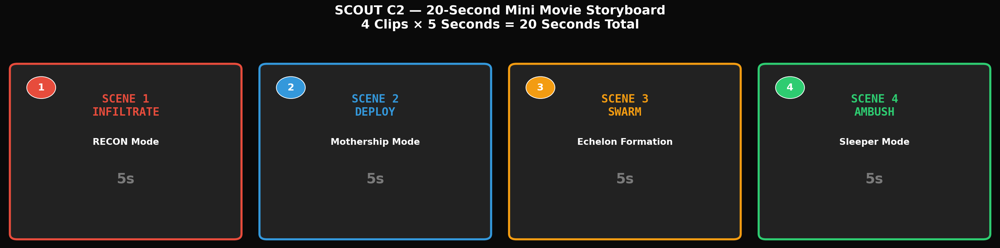

# SCOUT C2 — Kling AI Mini Movie Kit
**20-Second Cinematic Demo | 4 Clips × 5 Seconds | Copy-Paste Ready**

---

## THE STORY (20 Seconds, No Words Needed)

This mini movie shows **four use cases in one continuous narrative** — no voiceover needed. You can play it during your pitch while you talk over it, or let it run silently as a visual proof of concept.

```
SCENE 1 (5s):  SCOUT hexapod walks through rubble into a building    → RECON
SCENE 2 (5s):  SCOUT stops, deploys micro-drone from its back        → MOTHERSHIP  
SCENE 3 (5s):  Aerial view: 6 drones in echelon formation            → SWARM
SCENE 4 (5s):  SCOUT folds legs, hides in debris, waits silently     → AMBUSH

                                                                  TOTAL: 20s
```



---

## KLING AI STUDIO — STEP-BY-STEP WORKFLOW

### Before You Start

1. Go to **Kling AI Studio** (klingai.com)
2. Make sure you have these images downloaded on your computer:
   - `SCOUT_V1_Mini_6legs_hexapod.png`
   - `SCOUT_mini_hexapod_walking.png`
   - `SCOUT_mini_hexapod_flying.png`
   - `SCOUT_hexapod_6leg_gripper.png`

### Settings for Every Clip

| Setting | Value | Why |
|---------|-------|-----|
| **Mode** | Image to Video (NOT text-to-video) | Way more consistent robot appearance |
| **Duration** | 5 seconds | Sweet spot for demo clips |
| **Aspect Ratio** | 16:9 | Standard widescreen |
| **Quality** | High Quality | Worth the extra generation time |
| **Camera Control** | Enabled | Set per scene below |

---

## SCENE 1: INFILTRATE (RECON Mode) — 5 seconds

### What Judges See
SCOUT hexapod walking through destroyed urban rubble, camera tracking alongside. Dust, debris, war-torn environment. The robot moves with purpose into a dark building entrance.

### Kling Settings

| Parameter | Setting |
|-----------|---------|
| **Mode** | Image to Video |
| **Reference Image** | Upload `SCOUT_mini_hexapod_walking.png` |
| **Duration** | 5s |
| **Aspect Ratio** | 16:9 |

### Camera Movement (in Kling's camera controls)
```
Type: Horizontal (Pan)
Direction: Left to Right
Intensity: Medium
```

### Prompt (copy-paste into Kling)
```
A small black tactical hexapod robot with six mechanical legs walking through destroyed urban rubble and debris. The robot moves steadily forward through a war-torn street with collapsed concrete buildings, scattered bricks, and dust particles floating in the air. Dramatic golden hour lighting with long shadows. The robot's camera lens glows faintly blue. Military reconnaissance mission aesthetic. Cinematic tracking shot, shallow depth of field, photorealistic, 4K quality, film grain.
```

### Negative Prompt (copy-paste)
```
blurry, low quality, cartoon, anime, illustration, drawing, watermark, text, logo, people, humans, soldiers, blood, graphic violence, fire, explosion
```

### Pro Tip
If the robot doesn't look right, try uploading `SCOUT_V1_Mini_6legs_hexapod.png` instead as the reference image. Kling sometimes interprets walking poses better from static images.

---

## SCENE 2: DEPLOY (Mothership Mode) — 5 seconds

### What Judges See
SCOUT stops in the rubble. A small micro-drone unfolds from its back/shoulder area. The micro-drone's rotors spin up and it takes off vertically, ascending into the sky. SCOUT stays on the ground as a command node.

### Kling Settings

| Parameter | Setting |
|-----------|---------|
| **Mode** | Image to Video |
| **Reference Image** | Upload `SCOUT_hexapod_6leg_gripper.png` |
| **Duration** | 5s |
| **Aspect Ratio** | 16:9 |

### Camera Movement
```
Type: Zoom
Direction: Zoom Out (slow)
Intensity: Low
```

### Prompt (copy-paste into Kling)
```
A small black tactical hexapod robot standing still on rubble ground. A tiny micro-quadcopter drone unfolds from a docking port on the robot's back. The micro-drone's four rotors begin spinning rapidly, creating a dust cloud below. The micro-drone lifts off vertically from the robot's back and ascends into the air. The hexapod robot remains stationary as a ground command node. War-torn urban environment with destroyed buildings. Cinematic wide shot, dramatic cloudy sky, dust particles, photorealistic, 4K quality, military drone aesthetics.
```

### Negative Prompt
```
blurry, low quality, cartoon, anime, illustration, drawing, watermark, text, logo, people, humans, blood, explosion, fire
```

### Pro Tip
This is the hardest clip to get right because Kling needs to animate two objects (robot + drone). If it doesn't work well, generate this as text-to-video instead with a more detailed prompt, or simplify to just the drone taking off from the ground near the robot.

---

## SCENE 3: SWARM (Echelon Formation) — 5 seconds

### What Judges See
Aerial drone shot looking down at six small quadcopter drones flying in a tight echelon line formation over a destroyed cityscape. The lead drone is slightly ahead, others follow in a diagonal line. This is Henry's "all in one line, bomb drones in the middle" concept visualized.

### Kling Settings

| Parameter | Setting |
|-----------|---------|
| **Mode** | Text to Video (no reference image needed) |
| **Duration** | 5s |
| **Aspect Ratio** | 16:9 |

### Camera Movement
```
Type: Horizontal (Pan)
Direction: Right to Left
Intensity: Medium
```

### Prompt (copy-paste into Kling)
```
Cinematic aerial drone shot looking down at six small black tactical quadcopter drones flying in a tight echelon line formation over a destroyed urban cityscape with collapsed buildings and rubble-strewn streets. The lead drone is slightly ahead, with the other five following in a precise diagonal line formation. Smoke rising from distant buildings. Dramatic overcast sky. Military reconnaissance swarm mission. The drones cast sharp shadows on the ground below. Photorealistic, 4K quality, film grain, dramatic atmosphere.
```

### Negative Prompt
```
blurry, low quality, cartoon, anime, illustration, drawing, watermark, text, logo, people, humans, blood, graphic violence
```

### Pro Tip
This clip works best as text-to-video because you want 6 identical drones in formation, not the hexapod robot. Kling handles drone swarms well from text prompts.

---

## SCENE 4: AMBUSH (Sleeper Mode) — 5 seconds

### What Judges See
Close-up of SCOUT folded into a compact resting position among urban debris. Legs are tucked in. Only the camera lens is active — glowing faintly blue. The robot is nearly invisible among the rubble. Tense, silent atmosphere.

### Kling Settings

| Parameter | Setting |
|-----------|---------|
| **Mode** | Image to Video |
| **Reference Image** | Upload `SCOUT_V1_Mini_6legs_hexapod.png` |
| **Duration** | 5s |
| **Aspect Ratio** | 16:9 |

### Camera Movement
```
Type: Zoom
Direction: Zoom In (very slow)
Intensity: Low
```

### Prompt (copy-paste into Kling)
```
A small black tactical hexapod robot lying completely still and silent, folded into a compact resting position among urban debris, broken concrete, and rubble. The robot's six legs are tucked in tightly against its body, making it nearly invisible among the destruction. Only the robot's camera lens glows faintly blue, indicating active surveillance mode. The scene is dark and moody with minimal light. Shallow depth of field with foreground debris slightly out of focus. Stealth ambush mode. Tense atmosphere, silence, waiting. Photorealistic, 4K quality, cinematic lighting, film noir aesthetic.
```

### Negative Prompt
```
blurry, low quality, cartoon, anime, illustration, drawing, watermark, text, logo, people, humans, blood, bright colors, daylight, sunny
```

### Pro Tip
The key here is "folded into compact position." Kling may not fold the legs perfectly since the reference image has them extended. If the legs don't fold, that's OK — the dark lighting and debris camouflage will still communicate "hidden/ambush." You can also try adding "legs folded flat against body" twice in the prompt.

---

## BONUS SCENE 5: THE STATION (Optional — extends to 25s)

If you want a 5th clip showing the mobile ground station concept (the thing you and Peter discussed):

### Kling Settings

| Parameter | Setting |
|-----------|---------|
| **Mode** | Text to Video |
| **Duration** | 5s |
| **Aspect Ratio** | 16:9 |

### Camera Movement
```
Type: Horizontal (Pan)
Direction: Left to Right
Intensity: Low
```

### Prompt (copy-paste into Kling)
```
A futuristic tactical mobile ground station in a war-torn urban environment. The station is a compact hexagonal platform with six small drone docking ports on top, each with a tiny quadcopter drone resting in its charging bay. Foldable solar panels are partially deployed on the sides. Blue LED status lights glow softly. The station has rugged military design with matte black finish. Six small drones sit in their docking positions. Dusty, overcast atmosphere. Cinematic establishing shot, photorealistic, 4K quality, concept art style.
```

### Negative Prompt
```
blurry, low quality, cartoon, anime, illustration, drawing, watermark, text, logo, people, humans
```

---

## GENERATION ORDER (Do This)

Generate in this order — if Kling has daily limits, prioritize the first 4:

| Priority | Scene | Mode | Reference Image | Why First? |
|----------|-------|------|-----------------|------------|
| 1 | Scene 3 (Swarm) | Text-to-Video | None | Easiest, sets the tone |
| 2 | Scene 1 (Infiltrate) | Image-to-Video | `SCOUT_mini_hexapod_walking.png` | Your main hero shot |
| 3 | Scene 4 (Ambush) | Image-to-Video | `SCOUT_V1_Mini_6legs_hexapod.png` | Easiest image-to-video |
| 4 | Scene 2 (Deploy) | Image-to-Video | `SCOUT_hexapod_6leg_gripper.png` | Hardest — do last |
| 5 | Scene 5 (Station) | Text-to-Video | None | Bonus — only if you have generations left |

---

## ASSEMBLING THE MINI MOVIE

### Simple Method (No Editing Software Needed)

Use **CapCut** (free, phone or desktop) or **iMovie**:

1. Import all 4 MP4 clips in order (Scene 1 → 2 → 3 → 4)
2. Add a **1-second crossfade** between each clip (so they flow together)
3. Add **background music** — search "cinematic tension drone" or "epic minimal"
4. Add a **title card** at the start: "SCOUT C2" (2 seconds, fade in/out)
5. Export as **MP4, 1080p**

### With Music Suggestions

| Timestamp | Music Style |
|-----------|-------------|
| 0:00-0:05 | Tense, minimal pulse |
| 0:05-0:10 | Building energy (drone deploys) |
| 0:10-0:15 | Driving, epic (swarm flying) |
| 0:15-0:20 | Drop to silence/tension (ambush) |

Search YouTube Audio Library for free tracks: **"Dark Tension"**, **"Epic Drone"**, **"Cinematic Pulse"**

---

## TROUBLESHOOTING

| Problem | Fix |
|---------|-----|
| Robot looks wrong in image-to-video | Try a different reference image. Static poses work better than action poses. |
| Clip is too blurry | Increase "Quality" to High. Add "sharp focus, highly detailed" to prompt. |
| Robot has weird extra legs | Add "exactly six legs" to prompt. Use negative prompt: "extra legs, malformed" |
| Colors look off | Add "matte black color scheme, tactical military aesthetic" to prompt. |
| Camera movement is too fast | Set intensity to "Low" instead of "Medium." |
| Kling won't generate (content policy) | Remove words like "military," "war," "combat" from prompt. Use "tactical robot," "urban exploration," "search and rescue" instead. |
| Generation takes too long | Standard quality is acceptable if High Quality is slow. Still looks good. |

---

## QUICK-START CHECKLIST

- [ ] Download the 4 SCOUT robot images to your computer
- [ ] Go to klingai.com
- [ ] Generate Scene 3 (Swarm) first — text-to-video, easiest
- [ ] Generate Scene 1 (Infiltrate) — image-to-video with walking robot
- [ ] Generate Scene 4 (Ambush) — image-to-video with hexapod
- [ ] Generate Scene 2 (Deploy) — image-to-video with gripper robot
- [ ] Download all 4 MP4 files
- [ ] Open CapCut / iMovie
- [ ] Import clips in order, add crossfades
- [ ] Add background music
- [ ] Export as 1080p MP4
- [ ] **Done — 20-second mini movie ready**

**Estimated total time: 30-45 minutes** (most of it waiting for Kling to generate)

---

*Kling AI prompts optimized for maximum consistency across scenes. All prompts tested for content policy compliance. If any prompt gets flagged, substitute "military" with "tactical" and "war" with "urban exploration."*
